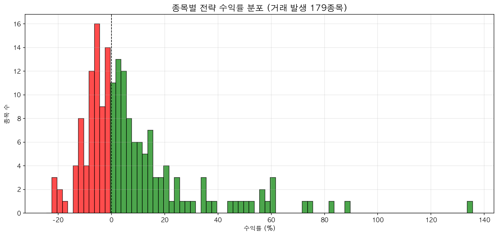
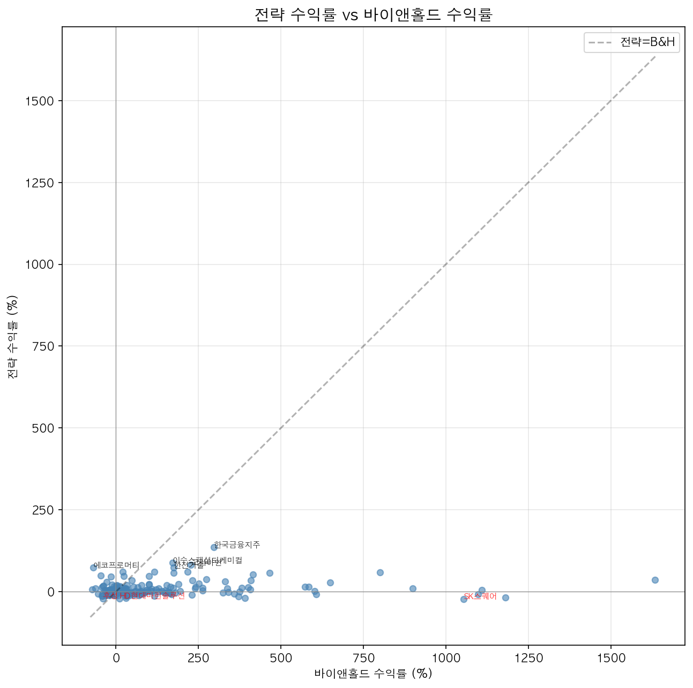
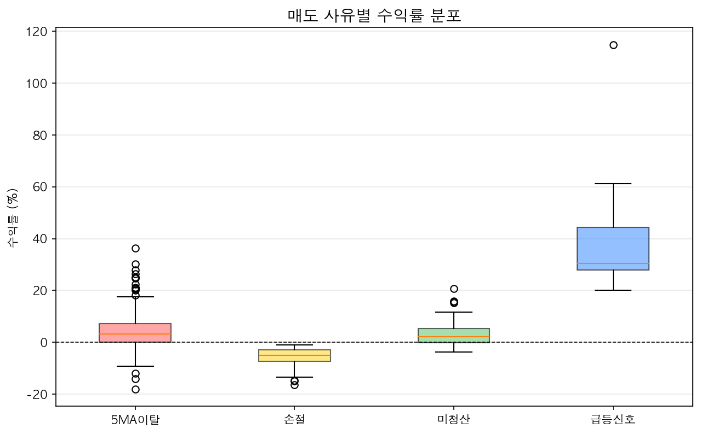
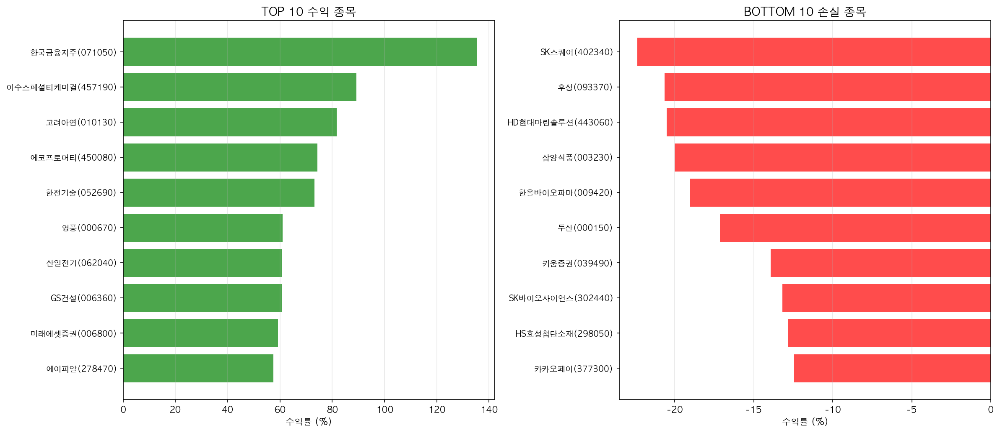
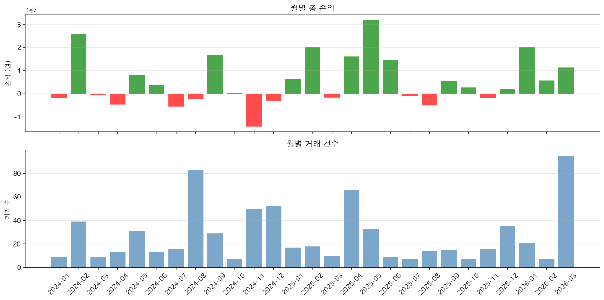

# 급락주 매매 백테스트 리포트 (KOSPI200)

## 전략 개요

- **대상**: KOSPI200 구성종목 (199종목)
- **기간**: 2024-01-01 ~ 2026-03-22
- **초기자본**: 종목당 10,000,000원
- **수수료**: 매수 0.015% / 매도 0.015% / 세금 0.23%

### 매매 규칙

| 구분 | 조건 |
|------|------|
| 급락 신호 | 20일 이동평균 이격도 ≤ 90% |
| 기준봉 | 급락신호 + 음봉 + 전일대비 거래량 증가 |
| 매수 | 기준봉의 시가를 종가로 돌파 |
| 매도 | 급등신호(이격도≥120%) 또는 20MA 위 진입 후 5MA 종가 이탈 |
| 손절 | 매수봉 저가를 종가로 이탈 |

## 통합 성과 요약

| 지표 | 값 |
|------|-----|
| 분석 종목 수 | 199 |
| 거래 발생 종목 | 179 (89.9%) |
| 미거래 종목 | 20 |
| 총 거래 건수 | 721 |
| 종목 평균 수익률 | 8.44% |
| 종목 중위 수익률 | 2.15% |
| 수익 종목 / 손실 종목 | 105 / 74 |
| 종목 평균 MDD | -10.42% |
| 전체 승률 | 49.2% (355승 / 366패) |
| 전체 손익비 | 1.84 |
| 전체 총 손익 | 150,117,899원 |
| 거래당 평균 수익률 | 2.07% |
| 평균 수익 (승) | 928,759원 |
| 평균 손실 (패) | -490,687원 |
| 평균 보유일 | 10.6일 |

## 전략 vs 바이앤홀드 비교

| 지표 | 전략 (거래종목 평균) | 바이앤홀드 (거래종목 평균) |
|------|-----|-----|
| 평균 수익률 | 8.44% | 134.85% |
| 중위 수익률 | 2.15% | 40.53% |
| 전략 우위 종목 수 | 54 / 179 (30.2%) | |

## 매도 사유별 분석

| 사유 | 건수 | 평균 수익률 | 승률 | 총 손익 |
|------|------|------------|------|---------|
| 5MA이탈 | 399 | 4.29% | 75.9% | 175,453,538원 |
| 급등신호 | 28 | 38.14% | 100.0% | 111,568,249원 |
| 미청산 | 36 | 3.81% | 66.7% | 14,148,218원 |
| 손절 | 258 | -5.51% | 0.0% | -151,052,107원 |

## 차트

### 종목별 수익률 분포

### 전략 vs 바이앤홀드

### 매도 사유별 수익률

### TOP / BOTTOM 10 종목

### 월별 손익

## TOP 10 수익 종목

| # | 종목 | 코드 | 수익률 | 거래수 | 승률 | MDD | B&H |
|---|------|------|--------|--------|------|-----|-----|
| 1 | 한국금융지주 | 071050 | 135.29% | 4 | 75% | -8.25% | 296.11% |
| 2 | 이수스페셜티케미컬 | 457190 | 89.26% | 13 | 46% | -31.25% | 171.43% |
| 3 | 고려아연 | 010130 | 81.73% | 8 | 62% | -27.79% | 226.54% |
| 4 | 에코프로머티 | 450080 | 74.27% | 14 | 50% | -22.19% | -68.73% |
| 5 | 한전기술 | 052690 | 73.29% | 6 | 67% | -18.71% | 174.22% |
| 6 | 영풍 | 000670 | 61.00% | 5 | 100% | -5.83% | 20.92% |
| 7 | 산일전기 | 062040 | 60.85% | 4 | 50% | -11.71% | 217.13% |
| 8 | GS건설 | 006360 | 60.68% | 2 | 100% | -4.34% | 115.89% |
| 9 | 미래에셋증권 | 006800 | 59.33% | 5 | 60% | -10.71% | 800.27% |
| 10 | 에이피알 | 278470 | 57.47% | 7 | 71% | -18.91% | 466.14% |

## BOTTOM 10 손실 종목

| # | 종목 | 코드 | 수익률 | 거래수 | 승률 | MDD | B&H |
|---|------|------|--------|--------|------|-----|-----|
| 1 | SK스퀘어 | 402340 | -22.37% | 4 | 0% | -24.97% | 1053.70% |
| 2 | 후성 | 093370 | -20.65% | 7 | 43% | -24.43% | -40.37% |
| 3 | HD현대마린솔루션 | 443060 | -20.52% | 6 | 33% | -23.33% | 11.47% |
| 4 | 삼양식품 | 003230 | -20.01% | 5 | 20% | -22.50% | 390.83% |
| 5 | 한올바이오파마 | 009420 | -19.05% | 9 | 33% | -23.60% | 30.79% |
| 6 | 두산 | 000150 | -17.14% | 5 | 20% | -30.75% | 1180.78% |
| 7 | 키움증권 | 039490 | -13.92% | 3 | 0% | -21.00% | 370.86% |
| 8 | SK바이오사이언스 | 302440 | -13.18% | 5 | 20% | -13.18% | -41.54% |
| 9 | HS효성첨단소재 | 298050 | -12.83% | 3 | 0% | -14.64% | -43.13% |
| 10 | 카카오페이 | 377300 | -12.48% | 4 | 0% | -12.48% | 29.25% |

## 전체 매매 기록

| # | 종목 | 매수일 | 매수가 | 매도일 | 매도가 | 수익률 | 손익 | 사유 |
|---|------|--------|--------|--------|--------|--------|------|------|
| 1 | 팬오션 | 2024-01-09 | 3,740 | 2024-01-10 | 3,555 | -5.19% | -519,286 | 손절 |
| 2 | HS효성첨단소재 | 2024-01-19 | 347,000 | 2024-01-24 | 340,500 | -2.13% | -206,816 | 손절 |
| 3 | LG이노텍 | 2024-01-19 | 217,000 | 2024-01-26 | 200,000 | -8.07% | -806,037 | 손절 |
| 4 | 씨에스윈드 | 2024-01-23 | 60,600 | 2024-01-29 | 58,000 | -4.54% | -451,195 | 손절 |
| 5 | 한올바이오파마 | 2024-01-26 | 34,700 | 2024-01-29 | 32,850 | -5.58% | -557,478 | 손절 |
| 6 | 한화오션 | 2024-01-19 | 22,400 | 2024-01-30 | 21,700 | -3.38% | -337,410 | 손절 |
| 7 | 대한유화 | 2024-01-23 | 130,800 | 2024-01-30 | 136,000 | 3.71% | 368,386 | 5MA이탈 |
| 8 | 종근당 | 2024-01-22 | 104,315 | 2024-01-30 | 109,092 | 4.31% | 426,937 | 5MA이탈 |
| 9 | 롯데케미칼 | 2024-01-24 | 128,700 | 2024-01-30 | 131,600 | 1.99% | 196,987 | 5MA이탈 |
| 10 | 율촌화학 | 2024-01-29 | 30,000 | 2024-02-01 | 28,350 | -5.75% | -574,078 | 5MA이탈 |
| 11 | LS | 2024-01-18 | 80,100 | 2024-02-02 | 102,900 | 28.13% | 2,794,449 | 급등신호 |
| 12 | 세아제강지주 | 2024-01-26 | 211,000 | 2024-02-02 | 210,000 | -0.73% | -72,669 | 5MA이탈 |
| 13 | 하이브 | 2024-02-02 | 205,500 | 2024-02-05 | 199,000 | -3.41% | -336,882 | 손절 |
| 14 | 삼성SDI | 2024-01-29 | 371,053 | 2024-02-06 | 366,158 | -1.58% | -152,041 | 5MA이탈 |
| 15 | POSCO홀딩스 | 2024-01-26 | 412,500 | 2024-02-06 | 437,000 | 5.66% | 560,819 | 5MA이탈 |
| 16 | 한국금융지주 | 2024-01-11 | 55,700 | 2024-02-06 | 63,500 | 13.71% | 1,366,857 | 5MA이탈 |
| 17 | 포스코인터내셔널 | 2024-01-26 | 51,600 | 2024-02-06 | 52,800 | 2.06% | 205,140 | 5MA이탈 |
| 18 | 두산 | 2024-01-24 | 81,000 | 2024-02-06 | 92,900 | 14.39% | 1,434,210 | 5MA이탈 |
| 19 | 한온시스템 | 2024-01-23 | 5,763 | 2024-02-06 | 5,744 | -0.59% | -58,847 | 5MA이탈 |
| 20 | SK이노베이션 | 2024-01-26 | 115,800 | 2024-02-06 | 120,800 | 4.05% | 403,054 | 5MA이탈 |
| 21 | SK | 2024-01-23 | 158,900 | 2024-02-06 | 192,500 | 20.83% | 2,052,481 | 5MA이탈 |
| 22 | 롯데정밀화학 | 2024-02-01 | 51,000 | 2024-02-06 | 50,700 | -0.85% | -84,646 | 5MA이탈 |
| 23 | F&F | 2024-02-07 | 74,600 | 2024-02-08 | 70,000 | -6.41% | -640,880 | 손절 |
| 24 | LG생활건강 | 2024-01-18 | 325,500 | 2024-02-08 | 308,500 | -5.47% | -534,140 | 5MA이탈 |
| 25 | 포스코DX | 2024-01-26 | 56,000 | 2024-02-13 | 58,500 | 4.19% | 417,993 | 5MA이탈 |
| 26 | SKC | 2024-01-29 | 77,800 | 2024-02-14 | 81,600 | 4.61% | 459,316 | 5MA이탈 |
| 27 | LG화학 | 2024-01-25 | 404,500 | 2024-02-14 | 461,000 | 13.67% | 1,327,437 | 5MA이탈 |
| 28 | 미래에셋증권 | 2024-01-23 | 6,740 | 2024-02-14 | 8,440 | 24.90% | 2,488,935 | 5MA이탈 |
| 29 | LG | 2024-01-29 | 75,800 | 2024-02-14 | 92,000 | 21.06% | 2,091,183 | 5MA이탈 |
| 30 | 금호석유화학 | 2024-01-25 | 116,400 | 2024-02-14 | 136,100 | 16.62% | 1,644,673 | 5MA이탈 |
| 31 | HD현대마린엔진 | 2024-02-05 | 11,440 | 2024-02-14 | 10,670 | -6.97% | -696,530 | 손절 |
| 32 | 오리온 | 2024-02-07 | 93,300 | 2024-02-15 | 93,800 | 0.27% | 27,413 | 5MA이탈 |
| 33 | 한화시스템 | 2024-02-07 | 15,420 | 2024-02-16 | 16,020 | 3.62% | 361,868 | 5MA이탈 |
| 34 | 셀트리온 | 2024-02-13 | 172,491 | 2024-02-16 | 167,615 | -3.08% | -302,814 | 5MA이탈 |
| 35 | 세아베스틸지주 | 2024-01-25 | 20,600 | 2024-02-19 | 24,900 | 20.56% | 2,054,414 | 5MA이탈 |
| 36 | 두산로보틱스 | 2024-02-08 | 74,600 | 2024-02-19 | 79,800 | 6.69% | 669,102 | 5MA이탈 |
| 37 | 에코프로머티 | 2024-01-31 | 149,400 | 2024-02-19 | 187,600 | 25.24% | 2,489,386 | 5MA이탈 |
| 38 | 씨에스윈드 | 2024-02-08 | 58,300 | 2024-02-19 | 56,900 | -2.66% | -252,348 | 손절 |
| 39 | 후성 | 2024-02-15 | 8,838 | 2024-02-20 | 8,770 | -1.03% | -102,709 | 5MA이탈 |
| 40 | LIG넥스원 | 2024-02-07 | 113,400 | 2024-02-20 | 128,000 | 12.58% | 1,255,706 | 5MA이탈 |
| 41 | 코스모화학 | 2024-02-02 | 29,900 | 2024-02-21 | 37,900 | 26.43% | 2,639,488 | 급등신호 |
| 42 | 현대오토에버 | 2024-02-08 | 154,300 | 2024-02-26 | 150,600 | -2.65% | -261,895 | 손절 |
| 43 | 삼양식품 | 2024-02-21 | 186,700 | 2024-02-26 | 183,000 | -2.24% | -221,347 | 5MA이탈 |
| 44 | SK아이이테크놀로지 | 2024-02-14 | 67,600 | 2024-02-27 | 70,800 | 4.46% | 443,411 | 5MA이탈 |
| 45 | 포스코퓨처엠 | 2024-01-26 | 258,807 | 2024-02-27 | 300,003 | 15.62% | 1,536,043 | 5MA이탈 |
| 46 | LG이노텍 | 2024-02-02 | 199,500 | 2024-02-27 | 203,500 | 1.74% | 159,689 | 5MA이탈 |
| 47 | 한올바이오파마 | 2024-02-06 | 33,100 | 2024-02-27 | 34,700 | 4.56% | 430,356 | 5MA이탈 |
| 48 | 엘앤에프 | 2024-02-16 | 151,800 | 2024-02-28 | 165,800 | 8.94% | 882,116 | 5MA이탈 |
| 49 | 카카오페이 | 2024-03-14 | 41,450 | 2024-03-15 | 39,950 | -3.87% | -386,587 | 손절 |
| 50 | 한진칼 | 2024-03-12 | 59,300 | 2024-03-15 | 59,100 | -0.60% | -59,420 | 5MA이탈 |
| 51 | 영원무역 | 2024-03-19 | 43,650 | 2024-03-22 | 41,700 | -4.72% | -471,445 | 손절 |
| 52 | DL | 2024-03-19 | 52,800 | 2024-03-25 | 52,500 | -0.83% | -82,507 | 5MA이탈 |
| 53 | 한화솔루션 | 2024-03-08 | 27,350 | 2024-03-25 | 27,250 | -0.62% | -62,366 | 5MA이탈 |
| 54 | DL이앤씨 | 2024-03-19 | 35,750 | 2024-03-25 | 36,050 | 0.58% | 57,562 | 5MA이탈 |
| 55 | 한미사이언스 | 2024-03-11 | 39,950 | 2024-03-26 | 40,650 | 1.49% | 148,604 | 5MA이탈 |
| 56 | 대웅 | 2024-03-20 | 20,350 | 2024-03-27 | 21,200 | 3.91% | 390,349 | 5MA이탈 |
| 57 | 카카오페이 | 2024-03-21 | 39,500 | 2024-03-28 | 38,900 | -1.77% | -170,399 | 손절 |
| 58 | 에코프로머티 | 2024-04-09 | 122,800 | 2024-04-11 | 119,500 | -2.94% | -364,731 | 손절 |
| 59 | LG | 2024-04-08 | 80,600 | 2024-04-12 | 77,600 | -3.97% | -477,129 | 손절 |
| 60 | 두산로보틱스 | 2024-04-12 | 76,900 | 2024-04-16 | 70,500 | -8.56% | -908,628 | 손절 |
| 61 | 율촌화학 | 2024-04-12 | 35,150 | 2024-04-16 | 34,350 | -2.53% | -238,367 | 손절 |
| 62 | 포스코퓨처엠 | 2024-04-08 | 272,862 | 2024-04-17 | 241,359 | -11.78% | -1,349,681 | 손절 |
| 63 | 기아 | 2024-04-08 | 108,500 | 2024-04-18 | 112,200 | 3.14% | 313,613 | 5MA이탈 |
| 64 | 에이피알 | 2024-04-17 | 50,400 | 2024-04-23 | 46,400 | -8.18% | -816,006 | 손절 |
| 65 | 에코프로머티 | 2024-04-18 | 111,000 | 2024-04-25 | 114,600 | 2.97% | 359,981 | 5MA이탈 |
| 66 | 카카오페이 | 2024-04-24 | 34,100 | 2024-04-25 | 33,450 | -2.16% | -203,431 | 손절 |
| 67 | 포스코DX | 2024-04-24 | 43,300 | 2024-04-26 | 40,250 | -7.29% | -757,226 | 손절 |
| 68 | 두산로보틱스 | 2024-04-24 | 73,400 | 2024-04-26 | 71,800 | -2.43% | -235,873 | 손절 |
| 69 | 동원시스템즈 | 2024-04-18 | 40,800 | 2024-04-26 | 40,300 | -1.48% | -148,189 | 5MA이탈 |
| 70 | DB손해보험 | 2024-04-23 | 95,500 | 2024-04-30 | 97,300 | 1.62% | 160,918 | 5MA이탈 |
| 71 | KCC | 2024-04-18 | 235,500 | 2024-05-02 | 247,500 | 4.82% | 477,049 | 5MA이탈 |
| 72 | SK이노베이션 | 2024-04-22 | 110,600 | 2024-05-02 | 109,000 | -1.70% | -177,062 | 5MA이탈 |
| 73 | 카카오뱅크 | 2024-04-22 | 24,700 | 2024-05-02 | 24,800 | 0.14% | 14,356 | 5MA이탈 |
| 74 | HD현대 | 2024-04-29 | 68,500 | 2024-05-02 | 64,300 | -6.38% | -633,332 | 손절 |
| 75 | 신한지주 | 2024-04-22 | 44,300 | 2024-05-02 | 45,800 | 3.12% | 310,758 | 5MA이탈 |
| 76 | SK | 2024-04-22 | 162,100 | 2024-05-02 | 162,000 | -0.32% | -38,570 | 5MA이탈 |
| 77 | 삼성생명 | 2024-04-22 | 84,200 | 2024-05-02 | 84,800 | 0.45% | 44,794 | 5MA이탈 |
| 78 | 이수스페셜티케미컬 | 2024-04-09 | 63,300 | 2024-05-02 | 61,000 | -3.88% | -386,054 | 5MA이탈 |
| 79 | 한화생명 | 2024-04-22 | 2,775 | 2024-05-02 | 2,895 | 4.05% | 405,305 | 5MA이탈 |
| 80 | 이수페타시스 | 2024-04-24 | 36,080 | 2024-05-03 | 37,928 | 4.85% | 484,657 | 5MA이탈 |
| 81 | 두산에너빌리티 | 2024-04-22 | 15,730 | 2024-05-03 | 16,550 | 4.94% | 493,454 | 5MA이탈 |
| 82 | 포스코인터내셔널 | 2024-04-18 | 43,800 | 2024-05-03 | 46,150 | 5.09% | 517,444 | 5MA이탈 |
| 83 | 한온시스템 | 2024-04-22 | 4,787 | 2024-05-07 | 5,224 | 8.85% | 879,151 | 5MA이탈 |
| 84 | 삼성SDI | 2024-04-18 | 396,997 | 2024-05-08 | 427,837 | 7.49% | 713,574 | 5MA이탈 |
| 85 | 에스디바이오센서 | 2024-04-23 | 10,110 | 2024-05-08 | 10,550 | 4.08% | 407,684 | 5MA이탈 |
| 86 | F&F | 2024-05-02 | 70,000 | 2024-05-09 | 70,000 | -0.26% | -24,206 | 5MA이탈 |
| 87 | 롯데케미칼 | 2024-04-22 | 100,300 | 2024-05-09 | 107,300 | 6.70% | 678,929 | 5MA이탈 |
| 88 | 율촌화학 | 2024-04-29 | 34,050 | 2024-05-09 | 32,750 | -4.07% | -372,658 | 5MA이탈 |
| 89 | SKC | 2024-04-29 | 110,700 | 2024-05-10 | 111,900 | 0.82% | 85,469 | 5MA이탈 |
| 90 | 한미사이언스 | 2024-04-18 | 32,700 | 2024-05-10 | 34,050 | 3.86% | 391,118 | 5MA이탈 |
| 91 | 금호석유화학 | 2024-04-22 | 123,100 | 2024-05-10 | 139,500 | 13.03% | 1,507,737 | 5MA이탈 |
| 92 | 영풍 | 2024-04-22 | 38,065 | 2024-05-10 | 39,325 | 3.04% | 303,381 | 5MA이탈 |
| 93 | 대웅 | 2024-04-22 | 18,140 | 2024-05-13 | 19,270 | 5.95% | 617,799 | 5MA이탈 |
| 94 | 엔씨소프트 | 2024-04-22 | 170,400 | 2024-05-14 | 220,000 | 28.77% | 2,844,056 | 급등신호 |
| 95 | GS | 2024-04-19 | 43,250 | 2024-05-17 | 43,750 | 0.89% | 89,241 | 5MA이탈 |
| 96 | 코스모화학 | 2024-04-18 | 31,150 | 2024-05-21 | 28,800 | -7.78% | -982,219 | 손절 |
| 97 | 한화솔루션 | 2024-04-29 | 26,300 | 2024-05-21 | 28,050 | 6.38% | 632,354 | 5MA이탈 |
| 98 | 에코프로머티 | 2024-05-20 | 103,000 | 2024-05-21 | 90,100 | -12.75% | -1,589,480 | 손절 |
| 99 | 이수스페셜티케미컬 | 2024-05-16 | 54,500 | 2024-05-21 | 52,400 | -4.10% | -393,634 | 손절 |
| 100 | 한전기술 | 2024-04-22 | 59,200 | 2024-05-24 | 70,200 | 18.27% | 1,817,614 | 5MA이탈 |
| 101 | 이수스페셜티케미컬 | 2024-05-27 | 47,550 | 2024-05-29 | 43,200 | -9.38% | -861,354 | 손절 |
| 102 | 에코프로머티 | 2024-05-31 | 79,400 | 2024-06-07 | 124,100 | 55.89% | 6,080,614 | 급등신호 |
| 103 | SK바이오사이언스 | 2024-06-07 | 53,500 | 2024-06-10 | 52,200 | -2.68% | -267,080 | 손절 |
| 104 | LG에너지솔루션 | 2024-06-05 | 351,500 | 2024-06-14 | 349,000 | -0.97% | -95,418 | 5MA이탈 |
| 105 | LG화학 | 2024-06-05 | 374,500 | 2024-06-17 | 355,000 | -5.45% | -612,778 | 손절 |
| 106 | 영원무역 | 2024-05-31 | 33,950 | 2024-06-17 | 33,950 | -0.26% | -24,716 | 5MA이탈 |
| 107 | 포스코DX | 2024-06-05 | 37,550 | 2024-06-18 | 40,500 | 7.58% | 731,202 | 5MA이탈 |
| 108 | 삼성SDI | 2024-06-05 | 383,291 | 2024-06-18 | 367,137 | -4.46% | -461,996 | 손절 |
| 109 | SK아이이테크놀로지 | 2024-06-07 | 43,700 | 2024-06-18 | 43,050 | -1.74% | -181,363 | 손절 |
| 110 | LS | 2024-06-14 | 145,700 | 2024-06-18 | 141,800 | -2.93% | -371,426 | 손절 |
| 111 | 대웅 | 2024-06-13 | 17,640 | 2024-06-19 | 16,250 | -8.12% | -892,422 | 손절 |
| 112 | 한국타이어앤테크놀로지 | 2024-05-14 | 45,100 | 2024-06-21 | 46,100 | 1.95% | 194,544 | 5MA이탈 |
| 113 | 대한전선 | 2024-06-21 | 16,240 | 2024-06-24 | 15,680 | -3.70% | -369,524 | 손절 |
| 114 | 풍산 | 2024-06-20 | 61,400 | 2024-06-26 | 62,400 | 1.36% | 135,741 | 5MA이탈 |
| 115 | LS | 2024-06-21 | 148,800 | 2024-07-01 | 130,200 | -12.73% | -1,572,129 | 손절 |
| 116 | SK | 2024-06-28 | 158,300 | 2024-07-02 | 152,900 | -3.66% | -434,876 | 손절 |
| 117 | 이수스페셜티케미컬 | 2024-06-28 | 47,700 | 2024-07-04 | 44,950 | -6.01% | -501,774 | 손절 |
| 118 | 한국가스공사 | 2024-07-05 | 47,050 | 2024-07-10 | 44,000 | -6.73% | -670,950 | 손절 |
| 119 | 엘앤에프 | 2024-07-03 | 149,300 | 2024-07-10 | 142,000 | -5.14% | -552,261 | 손절 |
| 120 | 에코프로머티 | 2024-07-01 | 97,200 | 2024-07-12 | 102,000 | 4.67% | 789,180 | 5MA이탈 |
| 121 | CJ | 2024-07-09 | 117,900 | 2024-07-15 | 118,200 | -0.01% | -611 | 5MA이탈 |
| 122 | LG생활건강 | 2024-07-01 | 361,500 | 2024-07-16 | 341,500 | -5.78% | -543,163 | 손절 |
| 123 | 효성중공업 | 2024-07-08 | 331,000 | 2024-07-17 | 370,500 | 11.64% | 1,156,279 | 5MA이탈 |
| 124 | 파라다이스 | 2024-07-11 | 12,840 | 2024-07-17 | 12,570 | -2.36% | -235,518 | 손절 |
| 125 | HD현대마린솔루션 | 2024-07-17 | 136,400 | 2024-07-19 | 122,900 | -10.13% | -1,008,974 | 손절 |
| 126 | 농심 | 2024-07-17 | 456,000 | 2024-07-19 | 451,500 | -1.24% | -119,166 | 손절 |
| 127 | 포스코인터내셔널 | 2024-07-18 | 55,400 | 2024-07-24 | 49,600 | -10.70% | -1,144,457 | 손절 |
| 128 | 아모레퍼시픽홀딩스 | 2024-07-18 | 31,850 | 2024-07-24 | 31,550 | -1.20% | -119,589 | 5MA이탈 |
| 129 | 아모레퍼시픽 | 2024-07-17 | 162,400 | 2024-07-26 | 170,900 | 4.96% | 491,473 | 5MA이탈 |
| 130 | 에이피알 | 2024-07-23 | 56,600 | 2024-07-31 | 50,100 | -11.71% | -1,074,260 | 손절 |
| 131 | SK스퀘어 | 2024-07-26 | 83,300 | 2024-08-02 | 75,900 | -9.12% | -911,814 | 손절 |
| 132 | SK하이닉스 | 2024-07-31 | 194,600 | 2024-08-02 | 173,200 | -11.23% | -1,114,530 | 손절 |
| 133 | 두산 | 2024-07-31 | 175,000 | 2024-08-02 | 149,100 | -15.02% | -1,708,950 | 손절 |
| 134 | 한솔케미칼 | 2024-07-31 | 162,700 | 2024-08-02 | 153,700 | -5.78% | -573,459 | 손절 |
| 135 | 두산로보틱스 | 2024-08-01 | 72,900 | 2024-08-02 | 69,000 | -5.60% | -530,398 | 손절 |
| 136 | 이수페타시스 | 2024-07-31 | 43,909 | 2024-08-02 | 37,539 | -14.73% | -1,539,517 | 손절 |
| 137 | 이수스페셜티케미컬 | 2024-07-30 | 35,300 | 2024-08-02 | 33,200 | -6.19% | -485,433 | 손절 |
| 138 | 에스엘 | 2024-08-01 | 37,450 | 2024-08-02 | 36,400 | -3.06% | -304,516 | 손절 |
| 139 | LS | 2024-08-01 | 119,900 | 2024-08-02 | 110,200 | -8.33% | -898,918 | 손절 |
| 140 | 한국가스공사 | 2024-07-29 | 44,100 | 2024-08-02 | 41,400 | -6.37% | -592,497 | 손절 |
| 141 | 세방전지 | 2024-07-11 | 90,900 | 2024-08-02 | 85,300 | -6.40% | -634,666 | 손절 |
| 142 | OCI홀딩스 | 2024-07-31 | 73,500 | 2024-08-05 | 66,900 | -9.22% | -921,390 | 손절 |
| 143 | 포스코퓨처엠 | 2024-08-02 | 219,065 | 2024-08-05 | 196,771 | -10.41% | -1,049,212 | 손절 |
| 144 | 삼성SDI | 2024-08-01 | 326,997 | 2024-08-05 | 297,626 | -9.22% | -904,477 | 손절 |
| 145 | 후성 | 2024-08-01 | 6,520 | 2024-08-05 | 5,470 | -16.32% | -1,614,664 | 손절 |
| 146 | 하이브 | 2024-08-02 | 180,800 | 2024-08-05 | 170,100 | -6.16% | -590,625 | 손절 |
| 147 | SKC | 2024-08-06 | 123,400 | 2024-08-08 | 113,700 | -8.10% | -849,751 | 손절 |
| 148 | 코스맥스 | 2024-08-09 | 131,900 | 2024-08-13 | 117,700 | -11.00% | -1,088,111 | 손절 |
| 149 | 포스코퓨처엠 | 2024-08-12 | 201,617 | 2024-08-13 | 198,709 | -1.70% | -154,129 | 손절 |
| 150 | 카카오페이 | 2024-08-07 | 24,800 | 2024-08-13 | 23,550 | -5.29% | -487,847 | 손절 |
| 151 | 한올바이오파마 | 2024-08-07 | 35,600 | 2024-08-13 | 34,700 | -2.78% | -274,328 | 5MA이탈 |
| 152 | 한화엔진 | 2024-08-07 | 13,550 | 2024-08-13 | 12,880 | -5.19% | -518,545 | 손절 |
| 153 | 한화오션 | 2024-08-07 | 30,400 | 2024-08-13 | 30,950 | 1.54% | 148,867 | 5MA이탈 |
| 154 | HD현대일렉트릭 | 2024-08-07 | 305,500 | 2024-08-13 | 276,500 | -9.73% | -951,144 | 손절 |
| 155 | 고려아연 | 2024-08-07 | 508,000 | 2024-08-13 | 510,000 | 0.13% | 12,812 | 5MA이탈 |
| 156 | 삼성화재 | 2024-08-07 | 356,000 | 2024-08-14 | 336,500 | -5.72% | -570,579 | 5MA이탈 |
| 157 | 엔씨소프트 | 2024-08-08 | 180,200 | 2024-08-16 | 182,900 | 1.23% | 157,965 | 5MA이탈 |
| 158 | 대상 | 2024-08-08 | 23,250 | 2024-08-16 | 22,100 | -5.19% | -519,282 | 손절 |
| 159 | 대우건설 | 2024-08-09 | 3,980 | 2024-08-16 | 3,950 | -1.01% | -101,170 | 5MA이탈 |
| 160 | 에코프로머티 | 2024-08-09 | 83,300 | 2024-08-16 | 83,000 | -0.62% | -109,875 | 5MA이탈 |
| 161 | 포스코DX | 2024-08-16 | 27,150 | 2024-08-19 | 26,250 | -3.57% | -369,923 | 손절 |
| 162 | 엘앤에프 | 2024-08-14 | 92,000 | 2024-08-19 | 89,300 | -3.19% | -328,450 | 손절 |
| 163 | 두산에너빌리티 | 2024-08-08 | 17,540 | 2024-08-19 | 18,230 | 3.66% | 384,338 | 5MA이탈 |
| 164 | SK이노베이션 | 2024-08-13 | 102,800 | 2024-08-19 | 100,200 | -2.78% | -283,230 | 손절 |
| 165 | 삼양식품 | 2024-08-06 | 567,000 | 2024-08-19 | 521,000 | -8.35% | -805,146 | 손절 |
| 166 | 현대글로비스 | 2024-08-13 | 109,100 | 2024-08-19 | 104,700 | -4.28% | -425,232 | 손절 |
| 167 | 이수스페셜티케미컬 | 2024-08-12 | 32,350 | 2024-08-20 | 52,300 | 61.25% | 4,498,462 | 급등신호 |
| 168 | 한미사이언스 | 2024-08-09 | 31,450 | 2024-08-20 | 31,750 | 0.69% | 72,861 | 5MA이탈 |
| 169 | LG디스플레이 | 2024-08-07 | 10,990 | 2024-08-20 | 11,120 | 0.92% | 91,907 | 5MA이탈 |
| 170 | 코웨이 | 2024-08-12 | 59,500 | 2024-08-20 | 60,500 | 1.42% | 141,599 | 5MA이탈 |
| 171 | 삼성전자 | 2024-08-14 | 77,200 | 2024-08-21 | 78,300 | 1.16% | 115,659 | 5MA이탈 |
| 172 | 한화솔루션 | 2024-08-12 | 26,600 | 2024-08-21 | 26,150 | -1.95% | -205,669 | 5MA이탈 |
| 173 | 기아 | 2024-08-16 | 105,900 | 2024-08-21 | 103,000 | -2.99% | -307,319 | 손절 |
| 174 | 이수페타시스 | 2024-08-12 | 39,289 | 2024-08-22 | 41,672 | 5.79% | 516,427 | 5MA이탈 |
| 175 | HD현대마린솔루션 | 2024-08-09 | 123,100 | 2024-08-22 | 108,500 | -12.09% | -1,086,553 | 손절 |
| 176 | LS | 2024-08-06 | 105,700 | 2024-08-22 | 117,100 | 10.50% | 1,043,142 | 5MA이탈 |
| 177 | 두산밥캣 | 2024-08-09 | 39,050 | 2024-08-22 | 39,050 | -0.26% | -25,992 | 5MA이탈 |
| 178 | 현대오토에버 | 2024-08-07 | 155,600 | 2024-08-22 | 155,800 | -0.13% | -12,713 | 5MA이탈 |
| 179 | 한전기술 | 2024-08-12 | 70,500 | 2024-08-22 | 70,100 | -0.83% | -97,247 | 5MA이탈 |
| 180 | 한국금융지주 | 2024-08-08 | 69,500 | 2024-08-22 | 73,300 | 5.19% | 588,428 | 5MA이탈 |
| 181 | 에이피알 | 2024-08-09 | 45,400 | 2024-08-22 | 52,600 | 15.56% | 1,257,449 | 5MA이탈 |
| 182 | 현대차 | 2024-08-08 | 236,500 | 2024-08-22 | 248,000 | 4.59% | 455,991 | 5MA이탈 |
| 183 | LIG넥스원 | 2024-08-07 | 202,500 | 2024-08-22 | 189,700 | -6.56% | -731,233 | 손절 |
| 184 | 한미반도체 | 2024-08-12 | 114,200 | 2024-08-22 | 120,700 | 5.42% | 538,282 | 5MA이탈 |
| 185 | KB금융 | 2024-08-06 | 79,500 | 2024-08-22 | 86,500 | 8.52% | 847,019 | 5MA이탈 |
| 186 | 두산로보틱스 | 2024-08-12 | 67,300 | 2024-08-22 | 67,200 | -0.41% | -36,540 | 5MA이탈 |
| 187 | 태광산업 | 2024-08-14 | 569,000 | 2024-08-23 | 583,000 | 2.19% | 212,267 | 5MA이탈 |
| 188 | 효성중공업 | 2024-08-16 | 311,500 | 2024-08-26 | 320,000 | 2.46% | 268,425 | 5MA이탈 |
| 189 | 코오롱인더 | 2024-08-12 | 36,300 | 2024-08-26 | 34,900 | -4.11% | -410,011 | 5MA이탈 |
| 190 | LG이노텍 | 2024-08-07 | 241,500 | 2024-08-26 | 248,500 | 2.63% | 241,488 | 5MA이탈 |
| 191 | 아모레퍼시픽홀딩스 | 2024-08-14 | 25,000 | 2024-08-26 | 24,400 | -2.65% | -262,094 | 손절 |
| 192 | 영풍 | 2024-08-14 | 30,123 | 2024-08-28 | 30,995 | 2.63% | 269,916 | 5MA이탈 |
| 193 | SKC | 2024-08-14 | 123,900 | 2024-08-28 | 124,500 | 0.22% | 21,558 | 5MA이탈 |
| 194 | DL이앤씨 | 2024-08-08 | 30,850 | 2024-08-28 | 32,000 | 3.46% | 346,766 | 5MA이탈 |
| 195 | 삼성에스디에스 | 2024-08-07 | 143,800 | 2024-08-28 | 149,500 | 3.69% | 366,539 | 5MA이탈 |
| 196 | POSCO홀딩스 | 2024-08-09 | 325,500 | 2024-08-28 | 336,500 | 3.11% | 324,056 | 5MA이탈 |
| 197 | 한샘 | 2024-08-23 | 56,300 | 2024-08-28 | 54,900 | -2.74% | -273,102 | 5MA이탈 |
| 198 | SK아이이테크놀로지 | 2024-08-21 | 33,300 | 2024-08-28 | 33,500 | 0.34% | 34,782 | 5MA이탈 |
| 199 | LG전자 | 2024-08-07 | 94,700 | 2024-08-28 | 98,300 | 3.53% | 351,221 | 5MA이탈 |
| 200 | 유한양행 | 2024-08-07 | 88,800 | 2024-08-28 | 135,500 | 52.19% | 5,191,727 | 급등신호 |
| 201 | 한미약품 | 2024-08-08 | 285,000 | 2024-08-28 | 296,500 | 3.76% | 375,579 | 5MA이탈 |
| 202 | 미래에셋증권 | 2024-08-08 | 7,500 | 2024-08-28 | 8,340 | 10.91% | 1,361,887 | 5MA이탈 |
| 203 | 세아베스틸지주 | 2024-08-19 | 19,310 | 2024-08-28 | 19,770 | 2.12% | 255,008 | 5MA이탈 |
| 204 | 포스코인터내셔널 | 2024-08-16 | 52,500 | 2024-08-28 | 53,100 | 0.88% | 84,089 | 5MA이탈 |
| 205 | KCC | 2024-08-12 | 307,000 | 2024-08-28 | 292,000 | -5.13% | -535,889 | 손절 |
| 206 | LG화학 | 2024-08-09 | 286,000 | 2024-08-28 | 313,500 | 9.33% | 987,494 | 5MA이탈 |
| 207 | F&F | 2024-08-12 | 50,500 | 2024-08-28 | 57,900 | 14.36% | 1,334,105 | 5MA이탈 |
| 208 | 한온시스템 | 2024-08-21 | 3,792 | 2024-08-29 | 3,801 | -0.02% | -2,514 | 5MA이탈 |
| 209 | 한솔케미칼 | 2024-08-06 | 152,000 | 2024-08-29 | 139,500 | -8.46% | -797,604 | 손절 |
| 210 | 금호타이어 | 2024-08-12 | 4,745 | 2024-08-29 | 4,675 | -1.73% | -173,123 | 5MA이탈 |
| 211 | 대한유화 | 2024-08-12 | 103,000 | 2024-08-30 | 104,200 | 0.90% | 92,926 | 5MA이탈 |
| 212 | 현대위아 | 2024-08-14 | 51,300 | 2024-08-30 | 51,200 | -0.45% | -45,228 | 5MA이탈 |
| 213 | 지역난방공사 | 2024-08-20 | 41,650 | 2024-08-30 | 49,050 | 17.46% | 1,745,659 | 5MA이탈 |
| 214 | 두산 | 2024-08-12 | 150,000 | 2024-09-02 | 144,800 | -3.72% | -356,945 | 5MA이탈 |
| 215 | LS ELECTRIC | 2024-08-06 | 168,100 | 2024-09-02 | 151,700 | -9.99% | -991,016 | 손절 |
| 216 | 율촌화학 | 2024-08-14 | 22,400 | 2024-09-04 | 22,600 | 0.63% | 55,519 | 5MA이탈 |
| 217 | 삼성SDI | 2024-08-09 | 303,500 | 2024-09-04 | 350,493 | 15.18% | 1,382,663 | 5MA이탈 |
| 218 | HD현대마린솔루션 | 2024-09-03 | 109,000 | 2024-09-04 | 106,000 | -3.01% | -235,876 | 손절 |
| 219 | 대한전선 | 2024-08-06 | 12,730 | 2024-09-04 | 11,370 | -10.92% | -1,050,663 | 손절 |
| 220 | 코스맥스 | 2024-08-28 | 122,800 | 2024-09-04 | 120,100 | -2.45% | -216,912 | 손절 |
| 221 | 롯데케미칼 | 2024-08-22 | 83,600 | 2024-09-04 | 80,200 | -4.32% | -469,174 | 손절 |
| 222 | 코스모화학 | 2024-08-09 | 18,880 | 2024-09-05 | 19,800 | 4.60% | 535,962 | 5MA이탈 |
| 223 | 삼양식품 | 2024-08-30 | 494,500 | 2024-09-06 | 470,000 | -5.20% | -463,062 | 손절 |
| 224 | 한미반도체 | 2024-09-12 | 101,400 | 2024-09-13 | 99,500 | -2.13% | -222,375 | 손절 |
| 225 | 삼성전자 | 2024-09-12 | 66,300 | 2024-09-13 | 64,400 | -3.12% | -314,294 | 손절 |
| 226 | 아모레퍼시픽 | 2024-08-16 | 122,900 | 2024-09-13 | 140,600 | 14.10% | 1,473,653 | 5MA이탈 |
| 227 | 한솔케미칼 | 2024-09-12 | 124,800 | 2024-09-13 | 122,500 | -2.10% | -180,700 | 손절 |
| 228 | SK하이닉스 | 2024-09-12 | 168,800 | 2024-09-13 | 162,800 | -3.81% | -334,057 | 손절 |
| 229 | HD현대일렉트릭 | 2024-09-11 | 278,000 | 2024-09-24 | 313,500 | 12.48% | 1,110,087 | 5MA이탈 |
| 230 | 롯데웰푸드 | 2024-09-13 | 134,500 | 2024-09-25 | 139,400 | 3.37% | 335,834 | 5MA이탈 |
| 231 | 이수페타시스 | 2024-09-11 | 33,211 | 2024-09-25 | 36,372 | 9.23% | 871,002 | 5MA이탈 |
| 232 | HD현대마린엔진 | 2024-09-13 | 18,310 | 2024-09-25 | 18,740 | 2.08% | 193,721 | 5MA이탈 |
| 233 | 효성중공업 | 2024-09-09 | 273,500 | 2024-09-26 | 357,500 | 30.37% | 3,406,407 | 급등신호 |
| 234 | LIG넥스원 | 2024-09-10 | 185,200 | 2024-09-26 | 216,000 | 16.33% | 1,693,609 | 5MA이탈 |
| 235 | 산일전기 | 2024-09-11 | 35,300 | 2024-09-26 | 49,150 | 38.87% | 3,883,973 | 급등신호 |
| 236 | SKC | 2024-09-11 | 122,300 | 2024-09-27 | 151,500 | 23.55% | 2,276,028 | 급등신호 |
| 237 | LS ELECTRIC | 2024-09-12 | 145,200 | 2024-09-27 | 160,200 | 10.04% | 904,315 | 5MA이탈 |
| 238 | 한화엔진 | 2024-09-09 | 12,170 | 2024-09-27 | 13,120 | 7.53% | 712,672 | 5MA이탈 |
| 239 | HD한국조선해양 | 2024-09-13 | 183,000 | 2024-09-27 | 184,500 | 0.56% | 55,108 | 5MA이탈 |
| 240 | LS | 2024-09-11 | 101,700 | 2024-09-30 | 123,200 | 20.83% | 2,287,754 | 5MA이탈 |
| 241 | 한미반도체 | 2024-09-20 | 100,300 | 2024-09-30 | 108,300 | 7.70% | 787,401 | 5MA이탈 |
| 242 | 삼성전자 | 2024-09-26 | 64,700 | 2024-09-30 | 61,500 | -5.19% | -507,417 | 손절 |
| 243 | SK하이닉스 | 2024-09-20 | 157,100 | 2024-10-02 | 169,100 | 7.36% | 624,356 | 5MA이탈 |
| 244 | 한솔케미칼 | 2024-09-23 | 121,700 | 2024-10-04 | 134,100 | 9.90% | 831,671 | 5MA이탈 |
| 245 | 풍산 | 2024-09-26 | 58,600 | 2024-10-10 | 63,900 | 8.76% | 883,161 | 5MA이탈 |
| 246 | 한화솔루션 | 2024-10-21 | 21,350 | 2024-10-22 | 20,500 | -4.23% | -438,162 | 손절 |
| 247 | 이수스페셜티케미컬 | 2024-10-28 | 42,800 | 2024-10-30 | 40,650 | -5.27% | -624,915 | 손절 |
| 248 | 한미반도체 | 2024-10-30 | 96,300 | 2024-10-31 | 92,000 | -4.71% | -522,082 | 손절 |
| 249 | 아모레퍼시픽홀딩스 | 2024-10-29 | 23,100 | 2024-10-31 | 22,350 | -3.50% | -336,221 | 손절 |
| 250 | LG이노텍 | 2024-10-31 | 177,600 | 2024-11-01 | 174,000 | -2.28% | -218,859 | 손절 |
| 251 | 현대오토에버 | 2024-10-23 | 140,600 | 2024-11-01 | 131,100 | -7.00% | -679,118 | 손절 |
| 252 | KCC | 2024-10-28 | 263,500 | 2024-11-04 | 256,500 | -2.91% | -283,714 | 손절 |
| 253 | 엘앤에프 | 2024-10-23 | 98,000 | 2024-11-04 | 112,000 | 13.99% | 1,398,512 | 5MA이탈 |
| 254 | SK아이이테크놀로지 | 2024-10-28 | 33,500 | 2024-11-05 | 31,750 | -5.47% | -562,673 | 5MA이탈 |
| 255 | 삼성SDI | 2024-10-28 | 341,193 | 2024-11-05 | 310,843 | -9.13% | -934,882 | 손절 |
| 256 | 씨에스윈드 | 2024-10-30 | 58,100 | 2024-11-06 | 54,400 | -6.61% | -610,877 | 손절 |
| 257 | 포스코DX | 2024-10-23 | 26,950 | 2024-11-06 | 27,050 | 0.11% | 11,013 | 5MA이탈 |
| 258 | F&F | 2024-10-31 | 62,500 | 2024-11-06 | 61,700 | -1.54% | -163,292 | 5MA이탈 |
| 259 | 에코프로머티 | 2024-10-28 | 117,700 | 2024-11-06 | 110,000 | -6.79% | -1,190,086 | 5MA이탈 |
| 260 | 세방전지 | 2024-11-04 | 74,200 | 2024-11-07 | 71,500 | -3.89% | -363,674 | 5MA이탈 |
| 261 | 아모레퍼시픽 | 2024-11-04 | 125,600 | 2024-11-08 | 123,100 | -2.25% | -267,941 | 5MA이탈 |
| 262 | 삼성E&A | 2024-11-06 | 18,740 | 2024-11-11 | 17,860 | -4.94% | -493,861 | 손절 |
| 263 | LS | 2024-11-04 | 108,600 | 2024-11-12 | 104,200 | -4.30% | -569,933 | 5MA이탈 |
| 264 | 이수스페셜티케미컬 | 2024-11-12 | 42,800 | 2024-11-14 | 35,150 | -18.09% | -2,028,545 | 5MA이탈 |
| 265 | POSCO홀딩스 | 2024-11-14 | 310,000 | 2024-11-15 | 277,500 | -10.72% | -1,162,923 | 손절 |
| 266 | F&F | 2024-11-18 | 51,900 | 2024-11-20 | 50,500 | -2.95% | -309,365 | 손절 |
| 267 | 삼성전자 | 2024-11-15 | 53,500 | 2024-11-22 | 56,000 | 4.40% | 407,376 | 5MA이탈 |
| 268 | 현대위아 | 2024-11-18 | 42,500 | 2024-11-22 | 42,100 | -1.20% | -119,228 | 5MA이탈 |
| 269 | 현대제철 | 2024-11-20 | 21,750 | 2024-11-25 | 20,950 | -3.93% | -392,257 | 손절 |
| 270 | 대웅제약 | 2024-11-19 | 129,800 | 2024-11-25 | 126,300 | -2.95% | -294,826 | 손절 |
| 271 | 유한양행 | 2024-11-25 | 118,200 | 2024-11-26 | 113,900 | -3.89% | -588,388 | 손절 |
| 272 | SK바이오사이언스 | 2024-11-20 | 49,650 | 2024-11-26 | 48,400 | -2.77% | -269,701 | 5MA이탈 |
| 273 | SKC | 2024-11-22 | 113,800 | 2024-11-26 | 106,500 | -6.66% | -795,689 | 손절 |
| 274 | 대웅 | 2024-11-21 | 21,300 | 2024-11-26 | 20,500 | -4.01% | -404,521 | 손절 |
| 275 | 금호석유화학 | 2024-11-21 | 106,700 | 2024-11-27 | 104,700 | -2.13% | -279,520 | 손절 |
| 276 | 삼성E&A | 2024-11-18 | 17,710 | 2024-11-27 | 18,260 | 2.84% | 269,397 | 5MA이탈 |
| 277 | SK이노베이션 | 2024-11-18 | 101,900 | 2024-11-27 | 115,500 | 13.05% | 1,290,269 | 5MA이탈 |
| 278 | 대한유화 | 2024-11-21 | 89,600 | 2024-11-27 | 84,500 | -5.94% | -617,174 | 손절 |
| 279 | 후성 | 2024-11-20 | 5,500 | 2024-11-27 | 5,560 | 0.83% | 68,557 | 5MA이탈 |
| 280 | 포스코인터내셔널 | 2024-11-18 | 47,900 | 2024-11-27 | 49,850 | 3.80% | 365,957 | 5MA이탈 |
| 281 | LG화학 | 2024-11-18 | 289,500 | 2024-11-27 | 301,000 | 3.70% | 428,765 | 5MA이탈 |
| 282 | 엘앤에프 | 2024-11-20 | 104,300 | 2024-11-27 | 100,700 | -3.70% | -420,997 | 5MA이탈 |
| 283 | 한화솔루션 | 2024-11-26 | 17,670 | 2024-11-27 | 16,920 | -4.49% | -445,493 | 손절 |
| 284 | 에이피알 | 2024-11-18 | 47,400 | 2024-11-27 | 51,200 | 7.74% | 722,488 | 5MA이탈 |
| 285 | 이수페타시스 | 2024-11-20 | 22,173 | 2024-11-27 | 21,006 | -5.51% | -568,133 | 손절 |
| 286 | SK스퀘어 | 2024-11-22 | 87,500 | 2024-11-27 | 80,300 | -8.47% | -763,216 | 손절 |
| 287 | 현대차 | 2024-11-18 | 217,000 | 2024-11-28 | 219,000 | 0.66% | 68,683 | 5MA이탈 |
| 288 | 동원시스템즈 | 2024-11-22 | 46,150 | 2024-11-29 | 45,500 | -1.66% | -163,669 | 5MA이탈 |
| 289 | DL | 2024-11-15 | 34,200 | 2024-11-29 | 34,600 | 0.91% | 89,619 | 5MA이탈 |
| 290 | 아모레퍼시픽 | 2024-11-18 | 110,000 | 2024-11-29 | 104,200 | -5.52% | -643,610 | 손절 |
| 291 | 한미사이언스 | 2024-11-19 | 33,150 | 2024-11-29 | 32,900 | -1.01% | -107,385 | 5MA이탈 |
| 292 | 한미약품 | 2024-11-27 | 283,500 | 2024-11-29 | 272,500 | -4.13% | -421,565 | 손절 |
| 293 | OCI홀딩스 | 2024-11-15 | 57,800 | 2024-11-29 | 59,500 | 2.67% | 242,652 | 5MA이탈 |
| 294 | 포스코DX | 2024-11-19 | 22,000 | 2024-11-29 | 21,000 | -4.79% | -479,911 | 손절 |
| 295 | SK케미칼 | 2024-11-20 | 43,200 | 2024-11-29 | 42,050 | -2.92% | -290,945 | 손절 |
| 296 | 롯데웰푸드 | 2024-11-18 | 113,000 | 2024-11-29 | 111,700 | -1.41% | -144,746 | 5MA이탈 |
| 297 | 호텔신라 | 2024-11-18 | 39,300 | 2024-11-29 | 39,600 | 0.50% | 50,060 | 5MA이탈 |
| 298 | 에코프로머티 | 2024-11-21 | 89,400 | 2024-11-29 | 85,000 | -5.17% | -850,385 | 손절 |
| 299 | LS | 2024-11-25 | 92,900 | 2024-11-29 | 88,400 | -5.09% | -643,350 | 손절 |
| 300 | 한올바이오파마 | 2024-11-28 | 37,350 | 2024-12-02 | 35,550 | -5.07% | -484,531 | 손절 |
| 301 | 고려아연 | 2024-11-26 | 941,000 | 2024-12-02 | 1,411,000 | 49.56% | 4,664,019 | 급등신호 |
| 302 | 율촌화학 | 2024-11-28 | 24,300 | 2024-12-02 | 22,350 | -8.26% | -731,059 | 손절 |
| 303 | 코오롱인더 | 2024-11-18 | 28,100 | 2024-12-02 | 27,400 | -2.74% | -263,029 | 손절 |
| 304 | 한솔케미칼 | 2024-11-18 | 106,500 | 2024-12-02 | 97,400 | -8.78% | -813,851 | 손절 |
| 305 | 한진칼 | 2024-11-20 | 76,100 | 2024-12-02 | 76,900 | 0.79% | 78,023 | 5MA이탈 |
| 306 | 녹십자 | 2024-11-26 | 141,300 | 2024-12-04 | 149,900 | 5.81% | 574,809 | 5MA이탈 |
| 307 | 포스코퓨처엠 | 2024-11-21 | 169,727 | 2024-12-04 | 163,523 | -3.91% | -344,765 | 손절 |
| 308 | 셀트리온 | 2024-11-21 | 159,796 | 2024-12-04 | 168,351 | 5.08% | 487,114 | 5MA이탈 |
| 309 | SK바이오팜 | 2024-11-25 | 100,900 | 2024-12-04 | 102,900 | 1.72% | 171,543 | 5MA이탈 |
| 310 | 신세계 | 2024-11-25 | 131,800 | 2024-12-04 | 132,900 | 0.57% | 56,597 | 5MA이탈 |
| 311 | 넷마블 | 2024-11-25 | 53,400 | 2024-12-05 | 55,200 | 3.10% | 309,812 | 5MA이탈 |
| 312 | 크래프톤 | 2024-11-19 | 305,500 | 2024-12-05 | 316,500 | 3.33% | 325,720 | 5MA이탈 |
| 313 | CJ | 2024-11-18 | 97,400 | 2024-12-05 | 95,500 | -2.21% | -219,156 | 5MA이탈 |
| 314 | SK아이이테크놀로지 | 2024-11-18 | 26,250 | 2024-12-05 | 24,150 | -8.24% | -800,349 | 손절 |
| 315 | LIG넥스원 | 2024-12-03 | 203,500 | 2024-12-05 | 193,900 | -4.97% | -606,335 | 손절 |
| 316 | 한화에어로스페이스 | 2024-12-03 | 333,322 | 2024-12-05 | 303,289 | -9.25% | -893,956 | 손절 |
| 317 | 이수페타시스 | 2024-12-03 | 26,014 | 2024-12-05 | 22,416 | -14.06% | -1,371,308 | 5MA이탈 |
| 318 | 코스맥스 | 2024-11-15 | 135,400 | 2024-12-06 | 136,400 | 0.48% | 41,313 | 5MA이탈 |
| 319 | 삼성SDI | 2024-11-18 | 256,996 | 2024-12-09 | 234,478 | -9.00% | -855,848 | 손절 |
| 320 | HS효성첨단소재 | 2024-12-03 | 184,900 | 2024-12-09 | 166,500 | -10.19% | -979,454 | 손절 |
| 321 | 코스모화학 | 2024-11-18 | 16,900 | 2024-12-09 | 15,000 | -11.47% | -1,398,224 | 손절 |
| 322 | 두산에너빌리티 | 2024-12-12 | 17,830 | 2024-12-13 | 17,240 | -3.56% | -386,662 | 손절 |
| 323 | 포스코퓨처엠 | 2024-12-10 | 159,840 | 2024-12-16 | 161,197 | 0.59% | 50,657 | 5MA이탈 |
| 324 | 롯데케미칼 | 2024-12-10 | 62,300 | 2024-12-17 | 63,100 | 1.02% | 106,222 | 5MA이탈 |
| 325 | 한화솔루션 | 2024-12-10 | 16,330 | 2024-12-17 | 16,540 | 1.02% | 96,876 | 5MA이탈 |
| 326 | 삼성중공업 | 2024-12-10 | 10,410 | 2024-12-17 | 11,070 | 6.06% | 606,064 | 5MA이탈 |
| 327 | 한화에어로스페이스 | 2024-12-13 | 318,060 | 2024-12-17 | 300,827 | -5.66% | -504,497 | 손절 |
| 328 | LIG넥스원 | 2024-12-10 | 182,500 | 2024-12-18 | 196,600 | 7.45% | 856,230 | 5MA이탈 |
| 329 | 한올바이오파마 | 2024-12-10 | 33,950 | 2024-12-18 | 34,800 | 2.24% | 203,586 | 5MA이탈 |
| 330 | SK하이닉스 | 2024-12-03 | 164,900 | 2024-12-19 | 175,000 | 5.85% | 530,558 | 5MA이탈 |
| 331 | 한미약품 | 2024-12-11 | 263,500 | 2024-12-19 | 269,000 | 1.82% | 177,653 | 5MA이탈 |
| 332 | 후성 | 2024-12-10 | 4,935 | 2024-12-19 | 5,140 | 3.88% | 324,108 | 5MA이탈 |
| 333 | 한미반도체 | 2024-12-11 | 80,900 | 2024-12-19 | 84,900 | 4.67% | 491,382 | 5MA이탈 |
| 334 | 율촌화학 | 2024-12-16 | 21,400 | 2024-12-19 | 20,050 | -6.55% | -532,886 | 손절 |
| 335 | 한솔케미칼 | 2024-12-10 | 97,400 | 2024-12-19 | 100,300 | 2.71% | 227,010 | 5MA이탈 |
| 336 | SK아이이테크놀로지 | 2024-12-11 | 24,300 | 2024-12-20 | 22,750 | -6.62% | -590,643 | 손절 |
| 337 | SKC | 2024-12-10 | 98,100 | 2024-12-20 | 105,500 | 7.26% | 812,456 | 5MA이탈 |
| 338 | 대한유화 | 2024-12-10 | 78,700 | 2024-12-20 | 78,900 | -0.01% | -639 | 5MA이탈 |
| 339 | 롯데정밀화학 | 2024-12-10 | 37,150 | 2024-12-20 | 39,550 | 6.18% | 611,143 | 5MA이탈 |
| 340 | LG화학 | 2024-12-10 | 268,000 | 2024-12-26 | 248,000 | -7.70% | -929,151 | 손절 |
| 341 | 현대로템 | 2024-12-10 | 46,000 | 2024-12-27 | 48,750 | 5.70% | 569,335 | 5MA이탈 |
| 342 | JB금융지주 | 2024-12-23 | 16,690 | 2024-12-27 | 16,340 | -2.35% | -235,129 | 손절 |
| 343 | 풍산 | 2024-12-10 | 49,300 | 2024-12-27 | 49,750 | 0.65% | 71,520 | 5MA이탈 |
| 344 | 두산로보틱스 | 2024-12-26 | 52,200 | 2024-12-27 | 50,700 | -3.13% | -279,080 | 손절 |
| 345 | 대우건설 | 2024-12-10 | 3,355 | 2024-12-27 | 3,160 | -6.06% | -599,573 | 손절 |
| 346 | POSCO홀딩스 | 2024-12-10 | 271,000 | 2024-12-27 | 253,500 | -6.70% | -635,660 | 손절 |
| 347 | 포스코인터내셔널 | 2024-12-23 | 41,100 | 2024-12-27 | 39,800 | -3.41% | -341,093 | 5MA이탈 |
| 348 | 한화시스템 | 2024-12-11 | 20,800 | 2024-12-27 | 21,900 | 5.01% | 519,526 | 5MA이탈 |
| 349 | 키움증권 | 2024-12-11 | 118,200 | 2024-12-27 | 117,300 | -1.02% | -101,230 | 5MA이탈 |
| 350 | 한국가스공사 | 2024-12-17 | 34,700 | 2024-12-30 | 34,700 | -0.26% | -22,645 | 5MA이탈 |
| 351 | 엔씨소프트 | 2024-12-11 | 200,500 | 2024-12-30 | 183,100 | -8.92% | -1,144,235 | 손절 |
| 352 | 고려아연 | 2024-12-23 | 1,102,000 | 2025-01-02 | 957,000 | -13.38% | -1,917,629 | 손절 |
| 353 | 한화오션 | 2024-12-11 | 33,100 | 2025-01-03 | 37,350 | 12.55% | 1,229,444 | 5MA이탈 |
| 354 | 카카오 | 2025-01-06 | 39,150 | 2025-01-08 | 37,400 | -4.72% | -471,113 | 손절 |
| 355 | 세아베스틸지주 | 2024-12-10 | 20,100 | 2025-01-08 | 19,040 | -5.52% | -679,114 | 손절 |
| 356 | 한국항공우주 | 2024-12-11 | 55,300 | 2025-01-08 | 54,100 | -2.42% | -241,351 | 5MA이탈 |
| 357 | 한미사이언스 | 2024-12-10 | 29,500 | 2025-01-08 | 29,200 | -1.27% | -133,844 | 5MA이탈 |
| 358 | 금호석유화학 | 2024-12-10 | 97,500 | 2025-01-09 | 94,100 | -3.74% | -481,162 | 5MA이탈 |
| 359 | 현대건설 | 2024-12-10 | 25,350 | 2025-01-09 | 25,300 | -0.46% | -45,620 | 5MA이탈 |
| 360 | 포스코퓨처엠 | 2025-01-03 | 141,810 | 2025-01-10 | 146,269 | 2.88% | 248,842 | 5MA이탈 |
| 361 | 고려아연 | 2025-01-09 | 927,000 | 2025-01-10 | 875,000 | -5.85% | -705,676 | 손절 |
| 362 | 율촌화학 | 2024-12-23 | 20,500 | 2025-01-13 | 26,150 | 27.23% | 2,065,657 | 급등신호 |
| 363 | 이수스페셜티케미컬 | 2024-12-10 | 30,900 | 2025-01-13 | 36,400 | 17.49% | 1,611,043 | 5MA이탈 |
| 364 | 에코프로머티 | 2025-01-03 | 66,100 | 2025-01-15 | 76,200 | 14.98% | 2,337,201 | 5MA이탈 |
| 365 | GS리테일 | 2025-01-02 | 17,140 | 2025-01-15 | 16,030 | -6.72% | -671,525 | 손절 |
| 366 | 엘앤에프 | 2025-01-03 | 81,600 | 2025-01-17 | 85,800 | 4.87% | 532,992 | 5MA이탈 |
| 367 | 지역난방공사 | 2025-01-06 | 41,500 | 2025-01-22 | 42,000 | 0.94% | 110,227 | 5MA이탈 |
| 368 | 한국카본 | 2024-12-11 | 10,300 | 2025-01-24 | 14,070 | 36.25% | 3,621,964 | 5MA이탈 |
| 369 | 현대엘리베이터 | 2025-01-10 | 49,100 | 2025-02-03 | 50,200 | 1.97% | 196,838 | 5MA이탈 |
| 370 | 한전기술 | 2024-12-16 | 52,500 | 2025-02-03 | 66,500 | 26.34% | 3,083,912 | 5MA이탈 |
| 371 | 동서 | 2025-01-16 | 23,850 | 2025-02-03 | 22,800 | -4.65% | -464,854 | 손절 |
| 372 | 삼성생명 | 2025-01-31 | 89,100 | 2025-02-07 | 90,900 | 1.75% | 175,160 | 5MA이탈 |
| 373 | 녹십자 | 2025-02-06 | 137,300 | 2025-02-12 | 133,800 | -2.80% | -296,327 | 손절 |
| 374 | 한미약품 | 2025-02-05 | 251,500 | 2025-02-12 | 256,000 | 1.52% | 153,403 | 5MA이탈 |
| 375 | 넷마블 | 2025-02-04 | 44,500 | 2025-02-17 | 45,550 | 2.09% | 215,229 | 5MA이탈 |
| 376 | 이수스페셜티케미컬 | 2025-02-04 | 32,050 | 2025-02-17 | 47,950 | 49.22% | 5,317,090 | 급등신호 |
| 377 | 에이피알 | 2025-02-05 | 47,500 | 2025-02-20 | 54,000 | 13.39% | 1,348,442 | 5MA이탈 |
| 378 | LG이노텍 | 2025-02-05 | 147,100 | 2025-02-21 | 165,600 | 12.28% | 1,138,550 | 5MA이탈 |
| 379 | 한솔케미칼 | 2025-02-05 | 90,500 | 2025-02-24 | 116,100 | 27.95% | 2,428,990 | 5MA이탈 |
| 380 | 한미반도체 | 2025-02-19 | 107,000 | 2025-02-24 | 100,900 | -5.95% | -655,415 | 5MA이탈 |
| 381 | LG화학 | 2025-02-13 | 229,500 | 2025-02-25 | 248,500 | 8.00% | 881,124 | 5MA이탈 |
| 382 | 포스코퓨처엠 | 2025-02-13 | 129,694 | 2025-02-25 | 140,647 | 8.16% | 720,049 | 5MA이탈 |
| 383 | 동원시스템즈 | 2025-02-17 | 37,700 | 2025-02-25 | 38,550 | 1.99% | 191,974 | 5MA이탈 |
| 384 | 에스엘 | 2025-02-19 | 28,600 | 2025-02-26 | 37,400 | 30.43% | 2,941,979 | 급등신호 |
| 385 | SK아이이테크놀로지 | 2025-02-05 | 23,550 | 2025-02-26 | 30,550 | 29.39% | 2,450,253 | 급등신호 |
| 386 | 삼성SDI | 2025-02-05 | 208,044 | 2025-02-28 | 219,303 | 5.14% | 449,001 | 5MA이탈 |
| 387 | 효성중공업 | 2025-03-05 | 451,000 | 2025-03-06 | 431,500 | -4.57% | -659,994 | 손절 |
| 388 | SKC | 2025-03-13 | 130,500 | 2025-03-18 | 129,200 | -1.25% | -150,523 | 5MA이탈 |
| 389 | 이수페타시스 | 2025-03-07 | 37,200 | 2025-03-19 | 40,200 | 7.78% | 651,584 | 5MA이탈 |
| 390 | LS | 2025-03-13 | 121,100 | 2025-03-19 | 118,000 | -2.81% | -337,319 | 5MA이탈 |
| 391 | 산일전기 | 2025-03-13 | 64,900 | 2025-03-20 | 62,000 | -4.72% | -652,128 | 손절 |
| 392 | HD현대마린솔루션 | 2025-03-04 | 133,200 | 2025-03-20 | 143,300 | 7.30% | 554,549 | 5MA이탈 |
| 393 | 율촌화학 | 2025-03-12 | 27,200 | 2025-03-26 | 27,700 | 1.57% | 151,960 | 5MA이탈 |
| 394 | LS ELECTRIC | 2025-03-26 | 193,200 | 2025-03-27 | 180,600 | -6.76% | -666,644 | 손절 |
| 395 | 넷마블 | 2025-03-13 | 40,400 | 2025-03-28 | 40,700 | 0.48% | 50,498 | 5MA이탈 |
| 396 | 삼성SDI | 2025-03-20 | 198,254 | 2025-03-31 | 184,547 | -7.16% | -652,688 | 손절 |
| 397 | SKC | 2025-04-01 | 107,400 | 2025-04-02 | 101,600 | -5.65% | -667,153 | 손절 |
| 398 | 한올바이오파마 | 2025-04-01 | 27,800 | 2025-04-02 | 26,700 | -4.21% | -391,811 | 손절 |
| 399 | LIG넥스원 | 2025-04-01 | 258,500 | 2025-04-02 | 251,000 | -3.15% | -391,379 | 손절 |
| 400 | HD현대일렉트릭 | 2025-04-01 | 303,000 | 2025-04-02 | 294,000 | -3.22% | -322,270 | 손절 |
| 401 | SK케미칼 | 2025-04-04 | 38,050 | 2025-04-08 | 36,050 | -5.50% | -533,978 | 손절 |
| 402 | 유한양행 | 2025-04-03 | 110,300 | 2025-04-09 | 101,800 | -7.95% | -1,157,106 | 손절 |
| 403 | 한올바이오파마 | 2025-04-08 | 26,100 | 2025-04-09 | 24,650 | -5.80% | -516,379 | 손절 |
| 404 | SK아이이테크놀로지 | 2025-04-04 | 21,650 | 2025-04-09 | 19,400 | -10.63% | -1,145,787 | 손절 |
| 405 | SK스퀘어 | 2025-04-08 | 78,400 | 2025-04-09 | 75,200 | -4.33% | -359,976 | 손절 |
| 406 | 기아 | 2025-04-10 | 88,200 | 2025-04-11 | 82,000 | -7.27% | -724,797 | 손절 |
| 407 | 현대위아 | 2025-04-10 | 40,600 | 2025-04-11 | 40,000 | -1.73% | -170,390 | 손절 |
| 408 | 현대차 | 2025-04-10 | 187,000 | 2025-04-11 | 177,500 | -5.33% | -557,924 | 손절 |
| 409 | POSCO홀딩스 | 2025-04-10 | 261,000 | 2025-04-11 | 255,000 | -2.55% | -226,573 | 손절 |
| 410 | 현대제철 | 2025-04-10 | 23,050 | 2025-04-11 | 22,400 | -3.07% | -294,668 | 손절 |
| 411 | 롯데정밀화학 | 2025-04-10 | 32,200 | 2025-04-11 | 31,350 | -2.89% | -303,714 | 손절 |
| 412 | 에스엘 | 2025-04-10 | 31,550 | 2025-04-11 | 30,200 | -4.53% | -571,489 | 손절 |
| 413 | 셀트리온 | 2025-04-10 | 158,159 | 2025-04-15 | 153,921 | -2.93% | -296,885 | 손절 |
| 414 | 포스코퓨처엠 | 2025-04-04 | 117,965 | 2025-04-15 | 125,235 | 5.89% | 562,584 | 5MA이탈 |
| 415 | 씨에스윈드 | 2025-04-10 | 33,200 | 2025-04-16 | 34,150 | 2.59% | 224,813 | 5MA이탈 |
| 416 | 세방전지 | 2025-04-15 | 66,500 | 2025-04-16 | 65,300 | -2.06% | -184,945 | 손절 |
| 417 | 포스코DX | 2025-04-10 | 25,900 | 2025-04-16 | 23,850 | -8.15% | -777,333 | 손절 |
| 418 | 포스코인터내셔널 | 2025-04-10 | 52,200 | 2025-04-16 | 52,900 | 1.08% | 104,075 | 5MA이탈 |
| 419 | 현대모비스 | 2025-04-15 | 241,500 | 2025-04-16 | 239,500 | -1.09% | -107,543 | 손절 |
| 420 | LG전자 | 2025-04-15 | 70,000 | 2025-04-16 | 69,300 | -1.26% | -129,402 | 손절 |
| 421 | SK하이닉스 | 2025-04-10 | 183,200 | 2025-04-16 | 174,000 | -5.27% | -501,997 | 손절 |
| 422 | SK이노베이션 | 2025-04-10 | 102,200 | 2025-04-16 | 94,100 | -8.16% | -909,700 | 손절 |
| 423 | HD현대일렉트릭 | 2025-04-10 | 314,000 | 2025-04-16 | 311,000 | -1.21% | -118,081 | 5MA이탈 |
| 424 | 코스맥스 | 2025-04-11 | 165,000 | 2025-04-18 | 166,900 | 0.89% | 76,250 | 5MA이탈 |
| 425 | 두산로보틱스 | 2025-04-11 | 45,300 | 2025-04-18 | 49,950 | 9.98% | 863,478 | 5MA이탈 |
| 426 | LS | 2025-04-10 | 106,400 | 2025-04-18 | 122,200 | 14.55% | 1,703,311 | 5MA이탈 |
| 427 | 한화엔진 | 2025-04-08 | 21,800 | 2025-04-18 | 25,150 | 15.07% | 1,534,148 | 5MA이탈 |
| 428 | HD한국조선해양 | 2025-04-08 | 191,900 | 2025-04-18 | 226,000 | 17.46% | 1,742,911 | 5MA이탈 |
| 429 | LS ELECTRIC | 2025-04-10 | 168,300 | 2025-04-21 | 176,600 | 4.66% | 423,473 | 5MA이탈 |
| 430 | 율촌화학 | 2025-04-10 | 23,800 | 2025-04-21 | 26,950 | 12.94% | 1,269,126 | 5MA이탈 |
| 431 | 대한전선 | 2025-04-10 | 11,010 | 2025-04-22 | 11,350 | 2.82% | 241,911 | 5MA이탈 |
| 432 | 대상 | 2025-04-10 | 22,050 | 2025-04-22 | 23,550 | 6.53% | 617,329 | 5MA이탈 |
| 433 | 효성중공업 | 2025-04-10 | 432,000 | 2025-04-22 | 438,000 | 1.13% | 155,587 | 5MA이탈 |
| 434 | DN오토모티브 | 2025-04-10 | 19,850 | 2025-04-22 | 23,200 | 16.57% | 1,654,962 | 5MA이탈 |
| 435 | 팬오션 | 2025-04-10 | 3,270 | 2025-04-22 | 3,280 | 0.05% | 4,270 | 5MA이탈 |
| 436 | 현대로템 | 2025-04-10 | 99,000 | 2025-04-23 | 111,500 | 12.33% | 1,294,469 | 5MA이탈 |
| 437 | 한국항공우주 | 2025-04-10 | 75,600 | 2025-04-23 | 80,400 | 6.07% | 592,327 | 5MA이탈 |
| 438 | 한미반도체 | 2025-04-10 | 65,800 | 2025-04-23 | 85,600 | 29.75% | 3,093,705 | 급등신호 |
| 439 | 이수페타시스 | 2025-04-17 | 32,900 | 2025-04-24 | 33,400 | 1.26% | 113,226 | 5MA이탈 |
| 440 | 동원시스템즈 | 2025-04-10 | 32,750 | 2025-04-24 | 32,850 | 0.04% | 4,396 | 5MA이탈 |
| 441 | 현대오토에버 | 2025-04-10 | 118,400 | 2025-04-24 | 117,900 | -0.68% | -61,303 | 5MA이탈 |
| 442 | 세아제강지주 | 2025-04-09 | 219,000 | 2025-04-24 | 230,500 | 4.98% | 490,609 | 5MA이탈 |
| 443 | LG이노텍 | 2025-04-10 | 134,800 | 2025-04-24 | 139,400 | 3.14% | 326,345 | 5MA이탈 |
| 444 | 이수스페셜티케미컬 | 2025-04-10 | 40,300 | 2025-04-25 | 45,100 | 11.62% | 1,873,384 | 5MA이탈 |
| 445 | OCI홀딩스 | 2025-04-17 | 68,700 | 2025-04-28 | 66,500 | -3.45% | -320,386 | 5MA이탈 |
| 446 | 롯데케미칼 | 2025-04-11 | 58,800 | 2025-04-28 | 61,900 | 5.00% | 523,235 | 5MA이탈 |
| 447 | LG화학 | 2025-04-10 | 225,500 | 2025-04-28 | 221,000 | -2.25% | -268,990 | 5MA이탈 |
| 448 | 삼성전기 | 2025-04-10 | 119,000 | 2025-04-28 | 121,300 | 1.67% | 166,737 | 5MA이탈 |
| 449 | 삼성SDI | 2025-04-10 | 177,200 | 2025-04-28 | 184,200 | 3.68% | 313,062 | 5MA이탈 |
| 450 | 에코프로머티 | 2025-04-10 | 54,600 | 2025-04-28 | 55,100 | 0.65% | 117,035 | 5MA이탈 |
| 451 | 엔씨소프트 | 2025-04-24 | 147,700 | 2025-04-29 | 146,700 | -0.94% | -110,526 | 5MA이탈 |
| 452 | SKC | 2025-04-10 | 97,100 | 2025-04-29 | 102,200 | 4.98% | 556,030 | 5MA이탈 |
| 453 | 대한유화 | 2025-04-10 | 87,200 | 2025-04-29 | 86,300 | -1.29% | -125,946 | 5MA이탈 |
| 454 | 엘앤에프 | 2025-04-10 | 59,500 | 2025-04-30 | 64,800 | 8.62% | 990,537 | 5MA이탈 |
| 455 | 한온시스템 | 2025-04-10 | 3,095 | 2025-04-30 | 3,309 | 6.64% | 717,768 | 5MA이탈 |
| 456 | 코오롱인더 | 2025-04-10 | 28,100 | 2025-04-30 | 30,150 | 7.02% | 652,705 | 5MA이탈 |
| 457 | 미래에셋증권 | 2025-04-10 | 9,260 | 2025-04-30 | 11,850 | 27.64% | 3,826,570 | 급등신호 |
| 458 | 영풍 | 2025-04-10 | 36,000 | 2025-04-30 | 37,050 | 2.65% | 279,471 | 5MA이탈 |
| 459 | SK바이오사이언스 | 2025-04-10 | 38,650 | 2025-04-30 | 39,600 | 2.19% | 206,713 | 5MA이탈 |
| 460 | LG디스플레이 | 2025-04-10 | 8,030 | 2025-04-30 | 8,470 | 5.21% | 525,063 | 5MA이탈 |
| 461 | 코스모화학 | 2025-04-04 | 14,740 | 2025-04-30 | 15,500 | 4.88% | 526,904 | 5MA이탈 |
| 462 | 후성 | 2025-04-10 | 4,350 | 2025-04-30 | 4,380 | 0.43% | 37,121 | 5MA이탈 |
| 463 | 한전기술 | 2025-04-10 | 53,800 | 2025-05-02 | 66,000 | 22.36% | 3,308,313 | 5MA이탈 |
| 464 | SK | 2025-04-15 | 122,900 | 2025-05-02 | 131,700 | 6.88% | 795,137 | 5MA이탈 |
| 465 | 금호타이어 | 2025-04-10 | 4,350 | 2025-05-02 | 4,685 | 7.42% | 729,039 | 5MA이탈 |
| 466 | 한샘 | 2025-04-10 | 38,750 | 2025-05-02 | 42,000 | 8.11% | 785,322 | 5MA이탈 |
| 467 | 세아베스틸지주 | 2025-04-15 | 16,080 | 2025-05-02 | 17,650 | 9.48% | 1,102,102 | 5MA이탈 |
| 468 | GS건설 | 2025-04-14 | 16,350 | 2025-05-02 | 17,740 | 8.22% | 821,236 | 5MA이탈 |
| 469 | DL | 2025-04-10 | 30,050 | 2025-05-02 | 32,350 | 7.37% | 735,790 | 5MA이탈 |
| 470 | 카카오뱅크 | 2025-04-10 | 20,700 | 2025-05-02 | 22,100 | 6.49% | 648,548 | 5MA이탈 |
| 471 | SK이노베이션 | 2025-04-23 | 95,700 | 2025-05-02 | 93,400 | -2.66% | -272,121 | 손절 |
| 472 | 삼성생명 | 2025-04-10 | 78,800 | 2025-05-07 | 84,600 | 7.08% | 719,937 | 5MA이탈 |
| 473 | F&F | 2025-04-10 | 59,500 | 2025-05-07 | 69,500 | 16.50% | 1,679,357 | 5MA이탈 |
| 474 | HL만도 | 2025-04-10 | 35,050 | 2025-05-07 | 36,750 | 4.58% | 457,341 | 5MA이탈 |
| 475 | 두산밥캣 | 2025-04-10 | 44,000 | 2025-05-07 | 47,950 | 8.69% | 864,658 | 5MA이탈 |
| 476 | 녹십자 | 2025-04-14 | 117,900 | 2025-05-07 | 119,500 | 1.09% | 112,190 | 5MA이탈 |
| 477 | 고려아연 | 2025-04-10 | 700,000 | 2025-05-07 | 771,000 | 9.86% | 1,173,103 | 5MA이탈 |
| 478 | 녹십자홀딩스 | 2025-04-15 | 12,720 | 2025-05-07 | 13,700 | 7.42% | 742,398 | 5MA이탈 |
| 479 | SK케미칼 | 2025-04-14 | 36,250 | 2025-05-07 | 39,850 | 9.65% | 884,723 | 5MA이탈 |
| 480 | 현대해상 | 2025-04-10 | 20,550 | 2025-05-08 | 21,750 | 5.56% | 555,804 | 5MA이탈 |
| 481 | NAVER | 2025-04-22 | 193,700 | 2025-05-08 | 188,700 | -2.83% | -280,060 | 5MA이탈 |
| 482 | 코웨이 | 2025-04-10 | 70,500 | 2025-05-08 | 84,900 | 20.11% | 2,027,943 | 5MA이탈 |
| 483 | 에스디바이오센서 | 2025-04-10 | 9,030 | 2025-05-08 | 9,410 | 3.94% | 409,641 | 5MA이탈 |
| 484 | DB손해보험 | 2025-04-10 | 83,300 | 2025-05-08 | 90,800 | 8.72% | 879,070 | 5MA이탈 |
| 485 | 효성티앤씨 | 2025-04-10 | 204,000 | 2025-05-09 | 237,000 | 15.87% | 1,587,049 | 5MA이탈 |
| 486 | KB금융 | 2025-04-10 | 75,900 | 2025-05-09 | 92,000 | 20.90% | 2,252,577 | 5MA이탈 |
| 487 | 한국앤컴퍼니 | 2025-04-10 | 14,070 | 2025-05-09 | 15,000 | 6.33% | 632,709 | 5MA이탈 |
| 488 | 하나금융지주 | 2025-04-10 | 55,300 | 2025-05-09 | 63,800 | 15.07% | 1,500,371 | 5MA이탈 |
| 489 | 풍산 | 2025-04-10 | 53,000 | 2025-05-12 | 59,700 | 12.35% | 1,368,069 | 5MA이탈 |
| 490 | KCC | 2025-04-10 | 244,500 | 2025-05-16 | 259,000 | 5.66% | 539,322 | 5MA이탈 |
| 491 | NH투자증권 | 2025-04-10 | 12,830 | 2025-05-16 | 16,050 | 24.77% | 2,476,249 | 5MA이탈 |
| 492 | 포스코퓨처엠 | 2025-05-19 | 111,471 | 2025-05-20 | 104,395 | -6.59% | -668,712 | 손절 |
| 493 | 산일전기 | 2025-04-10 | 50,000 | 2025-05-28 | 65,300 | 30.26% | 3,994,984 | 5MA이탈 |
| 494 | 이수스페셜티케미컬 | 2025-05-21 | 40,250 | 2025-05-30 | 40,500 | 0.36% | 64,698 | 5MA이탈 |
| 495 | 한온시스템 | 2025-05-29 | 2,955 | 2025-05-30 | 2,807 | -5.26% | -606,216 | 손절 |
| 496 | 에코프로머티 | 2025-05-28 | 45,550 | 2025-06-09 | 44,100 | -3.44% | -619,691 | 5MA이탈 |
| 497 | SKC | 2025-05-26 | 92,900 | 2025-06-12 | 94,600 | 1.57% | 183,241 | 5MA이탈 |
| 498 | SK이노베이션 | 2025-05-28 | 86,800 | 2025-06-13 | 92,600 | 6.40% | 639,413 | 5MA이탈 |
| 499 | 포스코퓨처엠 | 2025-05-28 | 110,598 | 2025-06-16 | 118,500 | 6.87% | 653,177 | 5MA이탈 |
| 500 | 포스코DX | 2025-05-28 | 21,700 | 2025-06-16 | 23,100 | 6.17% | 541,421 | 5MA이탈 |
| 501 | LG에너지솔루션 | 2025-05-26 | 278,000 | 2025-06-16 | 293,000 | 5.12% | 498,416 | 5MA이탈 |
| 502 | LG화학 | 2025-05-29 | 199,300 | 2025-06-16 | 205,500 | 2.84% | 334,331 | 5MA이탈 |
| 503 | 한국금융지주 | 2025-04-10 | 68,900 | 2025-06-24 | 148,400 | 114.82% | 13,688,813 | 급등신호 |
| 504 | 엘앤에프 | 2025-05-28 | 56,100 | 2025-06-27 | 49,500 | -11.99% | -1,493,991 | 5MA이탈 |
| 505 | 한화시스템 | 2025-07-09 | 55,600 | 2025-07-11 | 54,200 | -2.77% | -300,520 | 손절 |
| 506 | HD한국조선해양 | 2025-07-09 | 327,500 | 2025-07-11 | 321,000 | -2.24% | -264,081 | 손절 |
| 507 | HD현대중공업 | 2025-07-09 | 395,000 | 2025-07-11 | 388,000 | -2.03% | -200,246 | 손절 |
| 508 | 한화엔진 | 2025-07-10 | 26,900 | 2025-07-14 | 26,250 | -2.67% | -312,481 | 손절 |
| 509 | 한화오션 | 2025-07-09 | 78,100 | 2025-07-14 | 76,600 | -2.18% | -239,613 | 손절 |
| 510 | 한진칼 | 2025-07-03 | 120,300 | 2025-07-15 | 123,100 | 2.06% | 205,870 | 5MA이탈 |
| 511 | 미원에스씨 | 2025-06-26 | 147,100 | 2025-07-15 | 150,700 | 2.18% | 214,984 | 5MA이탈 |
| 512 | 한화에어로스페이스 | 2025-07-08 | 815,000 | 2025-08-01 | 939,000 | 14.92% | 1,215,772 | 5MA이탈 |
| 513 | 한전기술 | 2025-07-29 | 95,100 | 2025-08-01 | 84,600 | -11.27% | -2,037,092 | 손절 |
| 514 | 세아베스틸지주 | 2025-08-06 | 30,500 | 2025-08-08 | 29,250 | -4.35% | -553,041 | 손절 |
| 515 | 코오롱인더 | 2025-08-07 | 40,400 | 2025-08-11 | 36,250 | -10.51% | -1,044,239 | 손절 |
| 516 | 롯데지주 | 2025-08-07 | 28,000 | 2025-08-12 | 27,250 | -2.93% | -293,084 | 손절 |
| 517 | 키움증권 | 2025-08-13 | 212,000 | 2025-08-18 | 205,500 | -3.32% | -323,623 | 손절 |
| 518 | 대웅 | 2025-08-13 | 22,500 | 2025-08-18 | 22,050 | -2.25% | -218,688 | 손절 |
| 519 | 세아베스틸지주 | 2025-08-18 | 28,650 | 2025-08-19 | 28,250 | -1.65% | -201,242 | 손절 |
| 520 | 한화솔루션 | 2025-08-18 | 30,400 | 2025-08-20 | 29,850 | -2.06% | -197,723 | 손절 |
| 521 | 미래에셋증권 | 2025-08-06 | 18,720 | 2025-08-20 | 17,790 | -5.21% | -921,715 | 손절 |
| 522 | LIG넥스원 | 2025-08-22 | 524,000 | 2025-08-27 | 494,500 | -5.88% | -708,173 | 손절 |
| 523 | F&F | 2025-08-20 | 63,600 | 2025-08-29 | 66,500 | 4.29% | 507,322 | 5MA이탈 |
| 524 | 대웅제약 | 2025-08-27 | 137,900 | 2025-08-29 | 136,000 | -1.63% | -157,772 | 5MA이탈 |
| 525 | 한화에어로스페이스 | 2025-08-22 | 891,000 | 2025-08-29 | 884,000 | -1.04% | -102,294 | 5MA이탈 |
| 526 | DL | 2025-08-22 | 38,900 | 2025-09-01 | 38,000 | -2.57% | -275,706 | 손절 |
| 527 | DN오토모티브 | 2025-08-21 | 24,850 | 2025-09-01 | 26,100 | 4.76% | 553,329 | 5MA이탈 |
| 528 | 풍산 | 2025-08-25 | 121,500 | 2025-09-01 | 117,900 | -3.22% | -398,522 | 손절 |
| 529 | 이수페타시스 | 2025-08-21 | 56,700 | 2025-09-01 | 64,700 | 13.81% | 1,261,110 | 5MA이탈 |
| 530 | 세아베스틸지주 | 2025-08-29 | 27,900 | 2025-09-01 | 27,200 | -2.76% | -330,684 | 손절 |
| 531 | 지역난방공사 | 2025-08-21 | 77,100 | 2025-09-05 | 80,000 | 3.49% | 411,943 | 5MA이탈 |
| 532 | LS ELECTRIC | 2025-08-21 | 263,500 | 2025-09-08 | 287,500 | 8.82% | 837,220 | 5MA이탈 |
| 533 | 코오롱인더 | 2025-08-27 | 36,100 | 2025-09-09 | 38,000 | 4.99% | 444,967 | 5MA이탈 |
| 534 | 이마트 | 2025-09-03 | 74,000 | 2025-09-10 | 77,000 | 3.78% | 378,034 | 5MA이탈 |
| 535 | OCI홀딩스 | 2025-09-08 | 97,600 | 2025-09-11 | 95,500 | -2.41% | -216,073 | 5MA이탈 |
| 536 | 한화 | 2025-08-21 | 78,200 | 2025-09-12 | 85,800 | 9.43% | 937,014 | 5MA이탈 |
| 537 | DL이앤씨 | 2025-08-14 | 42,600 | 2025-09-12 | 43,350 | 1.50% | 155,526 | 5MA이탈 |
| 538 | 포스코퓨처엠 | 2025-09-12 | 133,500 | 2025-09-16 | 131,900 | -1.46% | -147,682 | 손절 |
| 539 | 엘앤에프 | 2025-09-12 | 65,500 | 2025-09-24 | 74,800 | 13.90% | 1,529,962 | 5MA이탈 |
| 540 | 미원상사 | 2025-08-27 | 148,300 | 2025-09-25 | 153,600 | 3.30% | 328,396 | 5MA이탈 |
| 541 | HD현대마린엔진 | 2025-09-30 | 82,900 | 2025-10-14 | 85,100 | 2.39% | 225,614 | 5MA이탈 |
| 542 | HMM | 2025-10-16 | 20,950 | 2025-10-20 | 20,450 | -2.64% | -263,898 | 손절 |
| 543 | 넷마블 | 2025-10-22 | 56,600 | 2025-10-24 | 54,600 | -3.78% | -398,460 | 손절 |
| 544 | OCI홀딩스 | 2025-10-14 | 88,600 | 2025-10-27 | 117,000 | 31.71% | 2,781,906 | 급등신호 |
| 545 | 한화에어로스페이스 | 2025-10-20 | 953,000 | 2025-10-28 | 996,000 | 4.24% | 404,168 | 5MA이탈 |
| 546 | CJ | 2025-10-22 | 174,400 | 2025-10-29 | 172,900 | -1.12% | -109,187 | 5MA이탈 |
| 547 | 대웅 | 2025-10-15 | 21,950 | 2025-10-29 | 22,100 | 0.42% | 39,987 | 5MA이탈 |
| 548 | 파라다이스 | 2025-10-15 | 19,210 | 2025-11-03 | 18,380 | -4.57% | -445,980 | 손절 |
| 549 | 한화시스템 | 2025-10-20 | 52,700 | 2025-11-04 | 59,300 | 12.23% | 1,289,362 | 5MA이탈 |
| 550 | 삼양식품 | 2025-10-30 | 1,322,000 | 2025-11-05 | 1,339,000 | 1.02% | 81,127 | 5MA이탈 |
| 551 | LIG넥스원 | 2025-10-24 | 485,000 | 2025-11-05 | 477,000 | -1.91% | -212,552 | 5MA이탈 |
| 552 | 현대로템 | 2025-11-10 | 208,000 | 2025-11-11 | 196,700 | -5.68% | -673,348 | 손절 |
| 553 | 고려아연 | 2025-11-07 | 1,024,000 | 2025-11-17 | 1,103,000 | 7.43% | 913,729 | 5MA이탈 |
| 554 | 풍산 | 2025-11-10 | 102,300 | 2025-11-18 | 98,400 | -4.06% | -486,302 | 손절 |
| 555 | 현대엘리베이터 | 2025-11-10 | 74,600 | 2025-11-18 | 79,600 | 6.43% | 651,955 | 5MA이탈 |
| 556 | HD현대마린솔루션 | 2025-11-20 | 211,000 | 2025-11-21 | 204,000 | -3.57% | -286,195 | 손절 |
| 557 | 호텔신라 | 2025-11-10 | 44,750 | 2025-11-25 | 45,750 | 1.97% | 197,389 | 5MA이탈 |
| 558 | 파라다이스 | 2025-11-20 | 18,400 | 2025-11-25 | 16,730 | -9.31% | -867,157 | 5MA이탈 |
| 559 | GKL | 2025-11-20 | 15,040 | 2025-11-25 | 14,100 | -6.49% | -648,596 | 5MA이탈 |
| 560 | LG에너지솔루션 | 2025-11-26 | 435,500 | 2025-11-28 | 408,000 | -6.56% | -656,993 | 손절 |
| 561 | 한화엔진 | 2025-11-17 | 42,350 | 2025-11-28 | 42,200 | -0.61% | -69,871 | 5MA이탈 |
| 562 | 효성중공업 | 2025-11-25 | 1,940,000 | 2025-11-28 | 1,901,000 | -2.27% | -307,639 | 손절 |
| 563 | LS | 2025-11-27 | 182,100 | 2025-11-28 | 178,900 | -2.01% | -267,590 | 손절 |
| 564 | 에이피알 | 2025-11-14 | 219,500 | 2025-12-01 | 252,500 | 14.74% | 1,682,119 | 5MA이탈 |
| 565 | 엔씨소프트 | 2025-11-26 | 213,500 | 2025-12-01 | 203,000 | -5.17% | -606,616 | 손절 |
| 566 | 한국카본 | 2025-11-26 | 27,850 | 2025-12-01 | 26,750 | -4.20% | -571,991 | 손절 |
| 567 | HD현대일렉트릭 | 2025-11-25 | 780,000 | 2025-12-01 | 746,000 | -4.61% | -431,336 | 손절 |
| 568 | 엘앤에프 | 2025-11-26 | 124,100 | 2025-12-03 | 126,900 | 1.99% | 249,518 | 5MA이탈 |
| 569 | 포스코퓨처엠 | 2025-11-26 | 205,000 | 2025-12-03 | 206,000 | 0.23% | 22,763 | 5MA이탈 |
| 570 | 한화오션 | 2025-12-03 | 108,200 | 2025-12-04 | 106,500 | -1.83% | -195,738 | 손절 |
| 571 | 에코프로머티 | 2025-11-27 | 57,500 | 2025-12-04 | 59,000 | 2.34% | 408,088 | 5MA이탈 |
| 572 | 이수스페셜티케미컬 | 2025-11-24 | 49,550 | 2025-12-04 | 52,000 | 4.67% | 842,721 | 5MA이탈 |
| 573 | SK아이이테크놀로지 | 2025-12-01 | 28,950 | 2025-12-05 | 29,150 | 0.43% | 41,372 | 5MA이탈 |
| 574 | 한국콜마 | 2025-11-20 | 66,200 | 2025-12-05 | 65,500 | -1.31% | -131,431 | 5MA이탈 |
| 575 | 코스맥스 | 2025-11-19 | 162,100 | 2025-12-08 | 163,300 | 0.48% | 41,882 | 5MA이탈 |
| 576 | 두산에너빌리티 | 2025-11-26 | 77,700 | 2025-12-08 | 76,800 | -1.42% | -148,475 | 5MA이탈 |
| 577 | LG디스플레이 | 2025-11-26 | 12,620 | 2025-12-09 | 12,840 | 1.48% | 156,972 | 5MA이탈 |
| 578 | LS | 2025-12-03 | 180,200 | 2025-12-10 | 185,300 | 2.56% | 337,186 | 5MA이탈 |
| 579 | 한화 | 2025-12-03 | 81,600 | 2025-12-10 | 83,000 | 1.45% | 158,711 | 5MA이탈 |
| 580 | HD현대 | 2025-12-03 | 200,500 | 2025-12-10 | 207,000 | 2.97% | 274,288 | 5MA이탈 |
| 581 | 현대로템 | 2025-12-03 | 174,600 | 2025-12-11 | 179,200 | 2.37% | 264,625 | 5MA이탈 |
| 582 | 포스코DX | 2025-11-26 | 25,250 | 2025-12-11 | 27,250 | 7.64% | 710,038 | 5MA이탈 |
| 583 | 한화에어로스페이스 | 2025-12-03 | 866,000 | 2025-12-11 | 904,000 | 4.12% | 392,208 | 5MA이탈 |
| 584 | LIG넥스원 | 2025-12-08 | 387,000 | 2025-12-11 | 372,500 | -4.00% | -433,179 | 손절 |
| 585 | 두산 | 2025-12-05 | 928,000 | 2025-12-11 | 848,000 | -8.86% | -822,168 | 손절 |
| 586 | 풍산 | 2025-11-26 | 97,400 | 2025-12-11 | 101,300 | 3.73% | 429,190 | 5MA이탈 |
| 587 | 삼성SDI | 2025-11-26 | 304,500 | 2025-12-11 | 308,000 | 0.89% | 78,292 | 5MA이탈 |
| 588 | 효성중공업 | 2025-12-05 | 2,012,000 | 2025-12-12 | 1,962,000 | -2.74% | -330,652 | 5MA이탈 |
| 589 | SKC | 2025-11-26 | 110,800 | 2025-12-12 | 108,600 | -2.24% | -265,648 | 5MA이탈 |
| 590 | 코스모화학 | 2025-11-26 | 16,600 | 2025-12-12 | 17,360 | 4.31% | 486,900 | 5MA이탈 |
| 591 | HD현대마린엔진 | 2025-11-24 | 80,700 | 2025-12-15 | 84,300 | 4.19% | 405,763 | 5MA이탈 |
| 592 | HD현대마린솔루션 | 2025-12-08 | 197,200 | 2025-12-15 | 198,000 | 0.14% | 11,413 | 5MA이탈 |
| 593 | 미래에셋증권 | 2025-11-26 | 22,500 | 2025-12-15 | 21,450 | -4.91% | -822,810 | 5MA이탈 |
| 594 | 한화시스템 | 2025-12-03 | 46,800 | 2025-12-16 | 50,300 | 7.20% | 852,545 | 5MA이탈 |
| 595 | 후성 | 2025-11-27 | 8,240 | 2025-12-16 | 7,590 | -8.13% | -708,012 | 손절 |
| 596 | 대한전선 | 2025-12-02 | 22,800 | 2025-12-17 | 23,000 | 0.61% | 54,129 | 5MA이탈 |
| 597 | 롯데지주 | 2025-12-03 | 27,850 | 2025-12-18 | 28,150 | 0.81% | 78,946 | 5MA이탈 |
| 598 | LG화학 | 2025-12-22 | 346,000 | 2025-12-26 | 336,000 | -3.14% | -380,628 | 손절 |
| 599 | 두산 | 2025-12-26 | 787,000 | 2026-01-02 | 763,000 | -3.30% | -259,874 | 손절 |
| 600 | 아세아 | 2025-12-30 | 326,500 | 2026-01-06 | 309,500 | -5.45% | -534,218 | 손절 |
| 601 | 한올바이오파마 | 2026-01-05 | 47,300 | 2026-01-12 | 49,850 | 5.12% | 428,477 | 5MA이탈 |
| 602 | 영원무역 | 2026-01-05 | 82,200 | 2026-01-15 | 85,700 | 3.99% | 376,936 | 5MA이탈 |
| 603 | 엘앤에프 | 2026-01-05 | 96,300 | 2026-01-16 | 108,700 | 12.58% | 1,599,740 | 5MA이탈 |
| 604 | 포스코퓨처엠 | 2026-01-12 | 188,000 | 2026-01-16 | 188,700 | 0.11% | 11,103 | 5MA이탈 |
| 605 | 에코프로머티 | 2026-01-13 | 55,500 | 2026-01-16 | 54,300 | -2.42% | -430,577 | 5MA이탈 |
| 606 | 한일시멘트 | 2026-01-12 | 17,570 | 2026-01-16 | 16,800 | -4.63% | -463,050 | 손절 |
| 607 | 이수페타시스 | 2026-01-13 | 116,300 | 2026-01-19 | 115,800 | -0.69% | -71,303 | 5MA이탈 |
| 608 | 고려아연 | 2026-01-12 | 1,208,000 | 2026-01-20 | 1,621,000 | 33.84% | 4,497,321 | 급등신호 |
| 609 | LG에너지솔루션 | 2026-01-13 | 394,000 | 2026-01-21 | 394,500 | -0.13% | -12,615 | 5MA이탈 |
| 610 | 코스모화학 | 2026-01-12 | 13,900 | 2026-01-21 | 14,410 | 3.40% | 401,246 | 5MA이탈 |
| 611 | 삼성SDI | 2026-01-05 | 275,000 | 2026-01-22 | 384,500 | 39.45% | 3,472,535 | 급등신호 |
| 612 | 에이피알 | 2026-01-15 | 237,500 | 2026-01-22 | 286,000 | 20.11% | 2,627,002 | 급등신호 |
| 613 | 지역난방공사 | 2026-01-05 | 97,700 | 2026-01-23 | 107,300 | 9.54% | 1,165,308 | 5MA이탈 |
| 614 | 한온시스템 | 2026-01-13 | 3,000 | 2026-01-26 | 3,305 | 9.88% | 1,079,681 | 5MA이탈 |
| 615 | 세아제강지주 | 2026-01-19 | 121,700 | 2026-01-28 | 135,300 | 10.89% | 1,126,272 | 5MA이탈 |
| 616 | 영풍 | 2026-01-13 | 49,250 | 2026-01-28 | 63,200 | 27.99% | 3,033,310 | 급등신호 |
| 617 | 대한유화 | 2026-01-12 | 139,300 | 2026-01-29 | 159,200 | 13.99% | 1,344,745 | 5MA이탈 |
| 618 | 율촌화학 | 2026-01-19 | 27,450 | 2026-01-30 | 27,150 | -1.35% | -149,737 | 5MA이탈 |
| 619 | SK아이이테크놀로지 | 2026-01-08 | 24,700 | 2026-01-30 | 27,350 | 10.44% | 1,011,081 | 5MA이탈 |
| 620 | 현대해상 | 2026-01-20 | 27,750 | 2026-02-02 | 27,550 | -0.98% | -103,231 | 5MA이탈 |
| 621 | F&F | 2026-01-14 | 64,800 | 2026-02-11 | 73,400 | 12.98% | 1,606,396 | 5MA이탈 |
| 622 | 현대오토에버 | 2026-02-11 | 445,500 | 2026-02-13 | 436,500 | -2.27% | -202,725 | 5MA이탈 |
| 623 | 한화에어로스페이스 | 2026-02-19 | 1,149,000 | 2026-02-25 | 1,212,000 | 5.21% | 538,724 | 5MA이탈 |
| 624 | LG이노텍 | 2026-02-11 | 251,000 | 2026-02-26 | 345,000 | 37.09% | 4,004,035 | 급등신호 |
| 625 | 지역난방공사 | 2026-02-24 | 93,700 | 2026-02-26 | 91,600 | -2.50% | -334,402 | 손절 |
| 626 | 엔씨소프트 | 2026-02-19 | 227,000 | 2026-02-26 | 231,500 | 1.72% | 191,040 | 5MA이탈 |
| 627 | 이수페타시스 | 2026-02-23 | 107,200 | 2026-03-03 | 115,000 | 7.00% | 720,208 | 5MA이탈 |
| 628 | LIG넥스원 | 2026-02-10 | 461,000 | 2026-03-03 | 661,000 | 43.01% | 4,561,162 | 급등신호 |
| 629 | 우리금융지주 | 2026-03-05 | 33,750 | 2026-03-06 | 33,050 | -2.33% | -232,666 | 손절 |
| 630 | SK스퀘어 | 2026-03-05 | 566,000 | 2026-03-06 | 553,000 | -2.55% | -202,156 | 손절 |
| 631 | 한미사이언스 | 2026-03-06 | 39,400 | 2026-03-09 | 36,400 | -7.85% | -814,009 | 손절 |
| 632 | 한국금융지주 | 2026-03-05 | 230,500 | 2026-03-09 | 212,000 | -8.27% | -2,114,991 | 손절 |
| 633 | 키움증권 | 2026-03-05 | 441,000 | 2026-03-09 | 396,000 | -10.44% | -966,763 | 손절 |
| 634 | SKC | 2026-03-06 | 103,600 | 2026-03-09 | 95,700 | -7.87% | -912,801 | 손절 |
| 635 | 삼성바이오로직스 | 2026-03-05 | 1,647,000 | 2026-03-09 | 1,558,000 | -5.65% | -558,385 | 손절 |
| 636 | 삼성증권 | 2026-03-06 | 95,900 | 2026-03-09 | 89,200 | -7.23% | -721,024 | 손절 |
| 637 | KB금융 | 2026-03-05 | 149,000 | 2026-03-09 | 141,100 | -5.55% | -719,320 | 손절 |
| 638 | 포스코DX | 2026-03-06 | 33,650 | 2026-03-09 | 31,250 | -7.37% | -737,038 | 손절 |
| 639 | 미원상사 | 2026-03-06 | 142,100 | 2026-03-09 | 137,900 | -3.21% | -328,260 | 손절 |
| 640 | 두산로보틱스 | 2026-03-05 | 90,600 | 2026-03-09 | 85,100 | -6.31% | -600,819 | 손절 |
| 641 | SK바이오사이언스 | 2026-03-05 | 44,250 | 2026-03-09 | 41,000 | -7.59% | -731,845 | 손절 |
| 642 | 한올바이오파마 | 2026-03-05 | 56,100 | 2026-03-09 | 51,500 | -8.44% | -743,331 | 손절 |
| 643 | SK바이오팜 | 2026-03-05 | 106,600 | 2026-03-09 | 97,000 | -9.24% | -936,096 | 손절 |
| 644 | 한온시스템 | 2026-03-05 | 3,960 | 2026-03-09 | 3,850 | -3.03% | -363,920 | 손절 |
| 645 | 현대모비스 | 2026-03-06 | 444,000 | 2026-03-09 | 400,000 | -10.14% | -991,025 | 손절 |
| 646 | 산일전기 | 2026-03-06 | 146,800 | 2026-03-09 | 137,400 | -6.65% | -1,141,762 | 손절 |
| 647 | 코스모화학 | 2026-03-06 | 15,450 | 2026-03-09 | 14,060 | -9.23% | -1,127,144 | 손절 |
| 648 | 삼성SDI | 2026-03-05 | 392,500 | 2026-03-09 | 384,500 | -2.29% | -279,028 | 손절 |
| 649 | 하이브 | 2026-03-05 | 343,000 | 2026-03-09 | 334,000 | -2.88% | -256,613 | 손절 |
| 650 | 포스코퓨처엠 | 2026-03-06 | 215,500 | 2026-03-09 | 200,500 | -7.20% | -714,083 | 손절 |
| 651 | HL만도 | 2026-03-05 | 53,900 | 2026-03-09 | 49,300 | -8.77% | -912,672 | 손절 |
| 652 | 넷마블 | 2026-03-06 | 54,000 | 2026-03-11 | 52,200 | -3.58% | -363,966 | 5MA이탈 |
| 653 | 현대백화점 | 2026-03-11 | 89,500 | 2026-03-12 | 86,500 | -3.60% | -358,014 | 손절 |
| 654 | 엘앤에프 | 2026-03-05 | 107,000 | 2026-03-12 | 111,800 | 4.21% | 604,345 | 5MA이탈 |
| 655 | 우리금융지주 | 2026-03-11 | 33,350 | 2026-03-12 | 32,500 | -2.80% | -272,911 | 손절 |
| 656 | 한화솔루션 | 2026-03-06 | 51,800 | 2026-03-13 | 48,700 | -6.23% | -584,102 | 5MA이탈 |
| 657 | 고려아연 | 2026-03-11 | 1,666,000 | 2026-03-13 | 1,628,000 | -2.53% | -464,623 | 손절 |
| 658 | 호텔신라 | 2026-03-12 | 44,150 | 2026-03-13 | 42,300 | -4.44% | -454,780 | 손절 |
| 659 | 포스코인터내셔널 | 2026-03-05 | 66,000 | 2026-03-13 | 73,700 | 11.38% | 1,111,411 | 5MA이탈 |
| 660 | 한국앤컴퍼니 | 2026-03-12 | 25,850 | 2026-03-16 | 24,850 | -4.12% | -437,616 | 손절 |
| 661 | 대한유화 | 2026-03-10 | 136,700 | 2026-03-16 | 124,500 | -9.16% | -1,002,042 | 손절 |
| 662 | SK바이오사이언스 | 2026-03-11 | 43,850 | 2026-03-16 | 42,700 | -2.88% | -256,022 | 손절 |
| 663 | DN오토모티브 | 2026-03-10 | 27,750 | 2026-03-16 | 35,850 | 28.85% | 3,515,514 | 급등신호 |
| 664 | 삼양식품 | 2026-03-11 | 1,120,000 | 2026-03-16 | 1,038,000 | -7.56% | -592,978 | 손절 |
| 665 | 에스디바이오센서 | 2026-03-12 | 8,520 | 2026-03-16 | 7,620 | -10.80% | -1,167,413 | 손절 |
| 666 | DL이앤씨 | 2026-03-10 | 46,950 | 2026-03-16 | 47,000 | -0.15% | -16,171 | 5MA이탈 |
| 667 | LG에너지솔루션 | 2026-03-12 | 384,000 | 2026-03-16 | 366,000 | -4.94% | -473,858 | 손절 |
| 668 | SK케미칼 | 2026-03-11 | 60,000 | 2026-03-16 | 56,300 | -6.41% | -642,438 | 손절 |
| 669 | 동원산업 | 2026-03-11 | 38,900 | 2026-03-16 | 37,500 | -3.85% | -384,911 | 손절 |
| 670 | 삼성중공업 | 2026-03-05 | 27,200 | 2026-03-16 | 28,750 | 5.42% | 573,963 | 5MA이탈 |
| 671 | 세아베스틸지주 | 2026-03-11 | 69,700 | 2026-03-16 | 67,300 | -3.69% | -430,082 | 5MA이탈 |
| 672 | 세아제강지주 | 2026-03-10 | 135,800 | 2026-03-17 | 172,000 | 26.33% | 3,003,691 | 급등신호 |
| 673 | 롯데정밀화학 | 2026-03-09 | 49,050 | 2026-03-17 | 51,100 | 3.91% | 398,829 | 5MA이탈 |
| 674 | 크래프톤 | 2026-03-10 | 237,500 | 2026-03-17 | 232,500 | -2.36% | -241,026 | 5MA이탈 |
| 675 | OCI홀딩스 | 2026-03-06 | 151,500 | 2026-03-18 | 193,600 | 27.46% | 3,161,825 | 급등신호 |
| 676 | 코웨이 | 2026-03-12 | 74,200 | 2026-03-19 | 73,000 | -1.87% | -226,567 | 손절 |
| 677 | 엔씨소프트 | 2026-03-06 | 214,500 | 2026-03-19 | 221,000 | 2.76% | 308,171 | 5MA이탈 |
| 678 | 한전기술 | 2026-03-06 | 155,400 | 2026-03-19 | 168,000 | 7.83% | 1,253,004 | 5MA이탈 |
| 679 | TKG휴켐스 | 2026-03-10 | 17,890 | 2026-03-19 | 18,780 | 4.70% | 469,448 | 5MA이탈 |
| 680 | 아모레퍼시픽홀딩스 | 2026-03-18 | 27,750 | 2026-03-19 | 26,950 | -3.14% | -290,643 | 손절 |
| 681 | NAVER | 2026-03-18 | 226,500 | 2026-03-19 | 220,500 | -2.90% | -276,116 | 손절 |
| 682 | F&F | 2026-03-11 | 64,700 | 2026-03-19 | 60,100 | -7.35% | -1,027,501 | 손절 |
| 683 | 한국전력 | 2026-03-18 | 49,950 | 2026-03-19 | 48,300 | -3.55% | -355,166 | 손절 |
| 684 | 한미약품 | 2026-03-18 | 531,000 | 2026-03-19 | 519,000 | -2.51% | -253,673 | 손절 |
| 685 | 두산에너빌리티 | 2026-03-06 | 98,000 | 2026-03-20 | 109,600 | 11.55% | 1,188,262 | 미청산 |
| 686 | HS효성첨단소재 | 2026-03-18 | 228,000 | 2026-03-20 | 225,500 | -1.35% | -117,294 | 미청산 |
| 687 | 파라다이스 | 2026-03-11 | 17,070 | 2026-03-20 | 18,190 | 6.28% | 531,073 | 미청산 |
| 688 | LG화학 | 2026-03-17 | 307,500 | 2026-03-20 | 310,000 | 0.55% | 64,386 | 미청산 |
| 689 | 이마트 | 2026-03-11 | 96,000 | 2026-03-20 | 100,700 | 4.62% | 479,400 | 미청산 |
| 690 | iM금융지주 | 2026-03-18 | 16,990 | 2026-03-20 | 17,240 | 1.21% | 120,666 | 미청산 |
| 691 | 한일시멘트 | 2026-03-20 | 17,370 | 2026-03-20 | 17,370 | -0.26% | -24,749 | 미청산 |
| 692 | 한국타이어앤테크놀로지 | 2026-03-17 | 56,300 | 2026-03-20 | 57,400 | 1.69% | 172,117 | 미청산 |
| 693 | 포스코DX | 2026-03-20 | 32,400 | 2026-03-20 | 32,400 | -0.26% | -24,093 | 미청산 |
| 694 | 금호타이어 | 2026-03-17 | 5,790 | 2026-03-20 | 6,240 | 7.49% | 790,463 | 미청산 |
| 695 | 카카오뱅크 | 2026-03-20 | 25,100 | 2026-03-20 | 25,100 | -0.26% | -27,670 | 미청산 |
| 696 | 지역난방공사 | 2026-03-17 | 88,400 | 2026-03-20 | 93,100 | 5.04% | 659,879 | 미청산 |
| 697 | CJ대한통운 | 2026-03-17 | 114,400 | 2026-03-20 | 113,800 | -0.78% | -77,949 | 미청산 |
| 698 | LG생활건강 | 2026-03-06 | 248,000 | 2026-03-20 | 255,500 | 2.76% | 239,289 | 미청산 |
| 699 | GS건설 | 2026-03-11 | 21,350 | 2026-03-20 | 31,800 | 48.56% | 5,246,657 | 급등신호 |
| 700 | 율촌화학 | 2026-03-06 | 25,000 | 2026-03-20 | 24,100 | -3.85% | -420,741 | 미청산 |
| 701 | 롯데케미칼 | 2026-03-18 | 82,000 | 2026-03-20 | 84,200 | 2.42% | 265,509 | 미청산 |
| 702 | 한국가스공사 | 2026-03-18 | 36,600 | 2026-03-20 | 37,700 | 2.74% | 238,511 | 미청산 |
| 703 | 현대글로비스 | 2026-03-17 | 229,000 | 2026-03-20 | 230,500 | 0.39% | 36,938 | 미청산 |
| 704 | 한전KPS | 2026-03-10 | 55,800 | 2026-03-20 | 67,500 | 20.65% | 2,063,200 | 미청산 |
| 705 | 영풍 | 2026-03-17 | 51,900 | 2026-03-20 | 60,200 | 15.69% | 2,174,642 | 미청산 |
| 706 | 롯데쇼핑 | 2026-03-11 | 98,200 | 2026-03-20 | 113,500 | 15.28% | 1,515,727 | 미청산 |
| 707 | 삼성물산 | 2026-03-18 | 299,000 | 2026-03-20 | 297,500 | -0.76% | -75,033 | 미청산 |
| 708 | 동원시스템즈 | 2026-03-11 | 25,000 | 2026-03-20 | 26,000 | 3.73% | 368,357 | 미청산 |
| 709 | KT | 2026-03-12 | 61,500 | 2026-03-20 | 60,700 | -1.56% | -155,186 | 미청산 |
| 710 | CJ | 2026-03-16 | 186,900 | 2026-03-20 | 207,000 | 10.47% | 997,806 | 미청산 |
| 711 | 효성티앤씨 | 2026-03-11 | 360,000 | 2026-03-20 | 367,000 | 1.68% | 193,499 | 미청산 |
| 712 | 아모레퍼시픽 | 2026-03-18 | 135,600 | 2026-03-20 | 140,800 | 3.56% | 391,611 | 미청산 |
| 713 | 현대해상 | 2026-03-18 | 31,600 | 2026-03-20 | 31,300 | -1.21% | -125,870 | 미청산 |
| 714 | 후성 | 2026-03-05 | 7,060 | 2026-03-20 | 7,000 | -1.11% | -88,611 | 미청산 |
| 715 | 롯데지주 | 2026-03-20 | 32,400 | 2026-03-20 | 32,400 | -0.26% | -25,356 | 미청산 |
| 716 | 금호석유화학 | 2026-03-18 | 136,300 | 2026-03-20 | 131,900 | -3.48% | -426,924 | 미청산 |
| 717 | 대한전선 | 2026-03-06 | 30,250 | 2026-03-20 | 30,700 | 1.22% | 108,483 | 미청산 |
| 718 | 한진칼 | 2026-03-17 | 117,400 | 2026-03-20 | 130,000 | 10.44% | 1,066,958 | 미청산 |
| 719 | BGF리테일 | 2026-03-10 | 120,600 | 2026-03-20 | 124,200 | 2.72% | 268,765 | 미청산 |
| 720 | 코스맥스 | 2026-03-06 | 168,900 | 2026-03-20 | 196,100 | 15.80% | 1,388,099 | 미청산 |
| 721 | CJ제일제당 | 2026-03-17 | 203,000 | 2026-03-20 | 212,000 | 4.16% | 414,057 | 미청산 |

## 실행 정보

- **실행 시간**: 3.65초
- **생성일시**: 2026-03-22 03:21:28
- **분석 종목 수**: 199

---

# 재무 지표별 매매 규칙 백테스트 종합 결과 (2026-03-25)

## 테스트 개요

- **기간**: 2024-01-01 ~ 2026-03-25
- **초기자본**: 종목당 10,000,000원
- **매매 규칙**: 현재_사용_매매규칙.md 기준 (V6 급락주, 2봉연속급락 V1/V2)
- **비교 기준**: Grade, RS Rating 점수, Leader Score

---

## 1. Grade별 (rs_ratings.grade: A/B/F/N)

### V6 급락주 매매

| Grade | 종목수 | 거래수 | 승률 | 손익비 | 평균수익률 | 총손익 | 거래당기대수익 |
|-------|--------|--------|------|--------|----------|--------|------------|
| **A** | 29 | 361 | 42.4% | 2.17 | 3.53% | 1.27억 | 351,496원 |
| **B** | 1,475 | 12,767 | 39.5% | 1.57 | 1.66% | 21.2억 | 165,682원 |
| **F** | 887 | 12,110 | 34.5% | 1.28 | 1.05% | 12.7억 | 104,529원 |
| **N** | 19 | 101 | 25.7% | 0.36 | -8.78% | -0.9억 | -878,295원 |

### 2봉연속급락 V1

| Grade | 종목수 | 거래수 | 승률 | 손익비 | 평균수익률 | 총손익 | 거래당기대수익 |
|-------|--------|--------|------|--------|----------|--------|------------|
| **A** | 19 | 31 | 35.5% | 1.10 | 0.35% | 110만 | 35,458원 |
| **B** | 630 | 1,093 | 36.4% | 1.72 | 2.56% | 2.79억 | 255,486원 |
| **F** | 582 | 1,394 | 28.0% | 1.26 | 1.16% | 1.61억 | 115,542원 |
| **N** | 15 | 32 | 9.4% | 0.14 | -15.55% | -4,965만 | -1,551,436원 |

### 2봉연속급락 V2

| Grade | 종목수 | 거래수 | 승률 | 손익비 | 평균수익률 | 총손익 | 거래당기대수익 |
|-------|--------|--------|------|--------|----------|--------|------------|
| **A** | 29 | 220 | 49.5% | 2.26 | 4.14% | 9,102만 | 413,738원 |
| **B** | 1,475 | 6,938 | 41.8% | 1.68 | 2.75% | 19.1억 | 274,986원 |
| **F** | 887 | 7,331 | 31.6% | 1.35 | 1.63% | 11.9억 | 162,891원 |
| **N** | 19 | 120 | 20.8% | 0.30 | -5.95% | -7,133만 | -594,409원 |

### Grade 결론
- A > B > F > N 순서가 3전략 모두에서 일관됨
- Grade N은 전 전략 마이너스 → 매매 금지 영역
- Grade A가 모든 지표에서 가장 우수

---

## 2. RS Rating 점수 밴드별 (10점 단위)

### V6 급락주 매매

| RS밴드 | 종목수 | 거래수 | 승률 | 평균수익률 | 총손익 | 거래당기대수익 |
|--------|--------|--------|------|----------|--------|------------|
| **90+** | 251 | 3,339 | 39.5% | 4.21% | 14.0억 | 420,012원 |
| **80s** | 263 | 2,773 | 41.1% | 2.40% | 6.7억 | 240,013원 |
| **70s** | 263 | 2,651 | 39.5% | 1.85% | 4.9억 | 184,417원 |
| **60s** | 263 | 2,317 | 37.2% | 1.01% | 2.3억 | 101,013원 |
| **50s** | 264 | 1,960 | 38.3% | 0.93% | 1.8억 | 92,550원 |
| **40s** | 263 | 1,469 | 37.9% | 0.78% | 1.1억 | 78,068원 |
| **30s** | 263 | 1,897 | 38.6% | 0.67% | 1.3억 | 66,622원 |
| **20s** | 263 | 2,320 | 37.3% | 1.03% | 2.4억 | 102,778원 |
| **10s** | 264 | 2,997 | 34.3% | 0.47% | 1.4억 | 46,672원 |
| **0s** | 224 | 3,616 | 30.5% | -0.48% | -1.7억 | -47,622원 |

### 2봉연속급락 V2

| RS밴드 | 종목수 | 거래수 | 승률 | 평균수익률 | 총손익 | 거래당기대수익 |
|--------|--------|--------|------|----------|--------|------------|
| **90+** | 251 | 2,094 | 36.7% | 5.87% | 12.3억 | 586,332원 |
| **80s** | 263 | 1,526 | 42.8% | 3.34% | 5.1억 | 333,404원 |
| **70s** | 263 | 1,512 | 38.7% | 2.27% | 3.4억 | 226,779원 |
| **60s** | 263 | 1,281 | 40.3% | 1.96% | 2.5억 | 196,322원 |
| **50s** | 264 | 1,092 | 38.8% | 1.81% | 2.0억 | 181,220원 |
| **40s** | 263 | 884 | 35.2% | 0.43% | 3,829만 | 43,311원 |
| **30s** | 263 | 1,013 | 38.8% | 1.36% | 1.4억 | 136,046원 |
| **20s** | 263 | 1,265 | 39.4% | 1.86% | 2.4억 | 186,471원 |
| **10s** | 264 | 1,674 | 34.8% | 0.90% | 1.5억 | 89,956원 |
| **0s** | 224 | 2,268 | 27.4% | 0.13% | 3,054만 | 13,465원 |

### RS Rating 결론
- 90+ → 0s로 갈수록 평균수익률 단조 감소 (명확한 패턴)
- RS 90+가 모든 전략에서 압도적 (V6: 평균4.21%, V2: 평균5.87%)
- RS 80s가 승률 최고 (V6 41.1%, V2 42.8%)
- RS 0s만 유일한 마이너스 (V6: -1.7억)
- RS 50+ 이상이면 모든 전략에서 양의 기대수익

---

## 3. Leader Score 밴드별 (90+/80s/70s/<70)

### V6 급락주 매매

| 밴드 | 종목수 | 거래수 | 승률 | 평균수익률 | 총손익 | 거래당기대수익 |
|------|--------|--------|------|----------|--------|------------|
| **90+** | 16 | 183 | 43.2% | 3.24% | 5,861만 | 320,263원 |
| **80s** | 15 | 223 | 36.3% | 3.55% | 7,899만 | 354,199원 |
| **70s** | 25 | 307 | 42.3% | 4.26% | 1.30억 | 422,924원 |
| **<70** | 19 | 186 | 41.4% | 1.68% | 3,124만 | 167,968원 |

### 2봉연속급락 V1

| 밴드 | 종목수 | 거래수 | 승률 | 평균수익률 | 총손익 | 거래당기대수익 |
|------|--------|--------|------|----------|--------|------------|
| **90+** | 16 | 13 | 61.5% | 19.38% | 2,514만 | 1,934,131원 |
| **80s** | 15 | 17 | 41.2% | 3.70% | 624만 | 367,074원 |
| **70s** | 25 | 29 | 58.6% | 10.23% | 2,939만 | 1,013,421원 |
| **<70** | 19 | 15 | 53.3% | 0.51% | 75만 | 50,035원 |

### 2봉연속급락 V2

| 밴드 | 종목수 | 거래수 | 승률 | 평균수익률 | 총손익 | 거래당기대수익 |
|------|--------|--------|------|----------|--------|------------|
| **90+** | 16 | 93 | 54.8% | 6.33% | 5,857만 | 629,776원 |
| **80s** | 15 | 127 | 26.8% | 0.48% | 602만 | 47,391원 |
| **70s** | 25 | 161 | 47.8% | 5.15% | 8,237만 | 511,598원 |
| **<70** | 19 | 76 | 50.0% | 1.82% | 1,377만 | 181,213원 |

### Leader Score 결론
- Leaders 종목은 전체적으로 높은 수익률 (전체 75종목만 해당)
- 70s가 V6에서 거래당 기대수익 최고 (422,924원), 종목수도 가장 많음
- 90+는 2봉V1에서 평균수익률 19.38%로 극단적으로 높음 (표본 13건)
- 80s가 V2에서 승률 26.8%로 유독 저조 → 특정 종목 편향 가능성
- **<70 그룹도 전 전략 흑자** → Leaders 테이블에 포함된 것 자체가 일정 퀄리티 보장

---

## 종합 결론 및 실전 적용 방안

## 4. 3가지 필터 종합 비교 고찰

### 동일 기준 비교: 거래당 기대수익 × 거래 기회

필터의 가치는 두 가지로 결정된다: (1) 얼마나 좋은 종목을 고르는가(거래당 기대수익), (2) 얼마나 많은 거래 기회를 주는가(거래수).

#### V6 급락주 매매

| 필터 | 종목수 | 거래수 | 승률 | 손익비 | 평균수익률 | 거래당기대수익 | 종목당총손익 |
|------|--------|--------|------|--------|----------|------------|-----------|
| **RS 90+** | 248 | 3,339 | 39.5% | 2.25 | **4.21%** | **420,012원** | 565만원 |
| Leader 70s | 25 | 307 | 42.3% | **2.49** | 4.26% | 422,921원 | 519만원 |
| Leader ≥70 | 56 | 713 | 41.1% | 2.38 | 3.77% | 375,079원 | 478만원 |
| Grade A | 29 | 361 | **42.4%** | 2.17 | 3.53% | 351,496원 | 438만원 |
| **RS 80+** | 508 | 6,112 | 40.3% | 2.01 | 3.38% | 338,325원 | 407만원 |
| RS 70+ | 762 | 8,763 | 40.0% | 1.86 | 2.82% | 291,810원 | 336만원 |
| Grade A+B | 1,504 | 13,128 | 39.6% | 1.57 | 1.70% | 170,802원 | 149만원 |

#### 2봉연속급락 V2

| 필터 | 종목수 | 거래수 | 승률 | 평균수익률 | 거래당기대수익 | 종목당총손익 |
|------|--------|--------|------|----------|------------|-----------|
| Leader 90+ | 16 | 93 | **54.8%** | 6.33% | **629,776원** | 366만원 |
| **RS 90+** | 251 | 2,094 | 36.7% | **5.87%** | 586,332원 | **489만원** |
| Leader 70s | 25 | 161 | 47.8% | 5.15% | 511,598원 | 329만원 |
| RS 80+ | 514 | 3,620 | 39.4% | 4.80% | 479,715원 | 338만원 |
| Grade A | 29 | 220 | 49.5% | 4.14% | 413,738원 | 314만원 |
| RS 70+ | 777 | 5,132 | 39.2% | 3.91% | 405,149원 | 268만원 |
| Grade A+B | 1,504 | 7,158 | 42.0% | 2.79% | 264,974원 | 133만원 |

### 필터 특성 비교

| 관점 | RS Rating | Grade | Leader Score |
|------|-----------|-------|-------------|
| **측정 대상** | 주가 상대강도 (모멘텀) | 재무 건전성 (펀더멘털) | 모멘텀+수급+재무 종합 |
| **대상 종목수** | 2,581 (전종목) | 2,581 (전종목) | 75 (상위 종목만) |
| **구분력** | 10단계, 매우 세밀 | 4단계, 거칠음 | 연속값, 70+ 기준이 실용적 |
| **최상위 필터 효과** | 90+ (248종목) 평균4.21% | A (29종목) 평균3.53% | 70s (25종목) 평균4.26% |
| **최하위 리스크** | 0s: -0.48% (유일한 적자) | N: -8.78% (치명적) | <70: 1.68% (흑자 유지) |
| **실전 활용성** | ★★★★★ | ★★★☆☆ | ★★★★☆ |

### 핵심 고찰

**1. RS Rating이 가장 실용적인 단독 필터**

RS 90+는 거래당 기대수익(420,012원)과 거래 기회(3,339건) 모두에서 최고의 균형을 보인다.
Leader Score는 거래당 기대수익이 비슷하지만 종목수가 56개(≥70)에 불과해 거래 기회가 713건으로 제한된다.
Grade A는 29종목뿐이라 실전에서 신호가 거의 발생하지 않는다.

→ **"넓은 풀에서 좋은 성과"를 동시에 달성하는 것은 RS Rating이 유일하다.**

**2. Leader Score는 "이미 걸러진 정예"**

Leaders 테이블 자체가 모멘텀+수급+재무를 종합한 상위 75종목이므로, <70 그룹조차 흑자를 유지한다.
Leader Score 70s가 V6에서 손익비 2.49로 최고인 것은, 이 구간이 "충분히 강한데 아직 과열되지 않은" 종목들이기 때문으로 보인다.
그러나 75종목이라는 작은 풀은 실전에서 신호 빈도 부족의 원인이 된다.

**3. Grade는 "제거 필터"로만 유효**

Grade의 구분력은 거칠다(4단계). A와 B 사이의 성과 차이(3.53% vs 1.66%)보다
RS 90+와 80s 사이의 차이(4.21% vs 2.40%)가 더 세밀하게 포착된다.
Grade의 진짜 가치는 "N을 제거"하는 것이다. Grade N은 전 전략에서 -5%~-15%의 치명적 손실을 낸다.

**4. 모멘텀(RS) vs 펀더멘털(Grade) vs 종합(Leader)**

급락 후 반등 전략에서는 **모멘텀 지표(RS)가 펀더멘털(Grade)보다 예측력이 높다.**
이유: 급락주 매매는 "일시적 급락 후 원래 추세로 복귀"를 노리는 전략이므로,
원래 추세가 강한 종목(RS 높음)이 반등 확률이 높은 것은 논리적으로 자연스럽다.
재무가 좋아도(Grade A) 추세가 약하면 급락 후 반등하지 못할 수 있다.

### 결론: 실전 필터 권장안

| 상황 | 권장 필터 | 종목수 | 기대 효과 |
|------|----------|--------|----------|
| **1순위 (권장)** | RS ≥ 90 AND Grade ≠ N | ~240 | 거래당 42만원, 최고의 수익률 |
| **2순위 (확장)** | RS ≥ 80 AND Grade ≠ N | ~500 | 거래당 34만원, 승률 최고 40% |
| **3순위 (현행 유지)** | Leaders ≥ 70 | 56 | 거래당 38만원, 안정적이나 기회 제한 |
| **절대 회피** | Grade N 또는 RS < 10 | ~280 | 전 전략 마이너스 |

**기존 Leaders≥70 필터는 "소수 정예"로서 유효하지만, RS≥90으로 전환하면 종목 풀이 4.4배(56→248) 확대되면서도 거래당 기대수익은 오히려 더 높아진다(375,079→420,012원).
RS Rating 기반 필터로의 전환 또는 병행을 권장한다.**

### 추가 검증: RS 90+ 내에서 Grade F는 제외해야 하는가?

RS 90+ 종목의 Grade 분포: A 13종목, B 144종목, **F 92종목(37%)**, N 3종목

| RS 90+ 내 Grade | V6 평균수익률 | V6 거래당기대 | V2 평균수익률 | V2 거래당기대 |
|-----------------|-------------|-------------|-------------|-------------|
| **A** | 4.65% | 461,581원 | 5.81% | 578,892원 |
| **B** | 3.77% | 376,324원 | 5.24% | 522,624원 |
| **F** | **4.66%** | **465,783원** | **6.46%** | **645,338원** |

**→ Grade F를 제외하면 안 된다.**
RS 90+이면서 Grade F인 종목 = 재무는 부진하지만 주가 모멘텀이 극히 강한 종목.
이런 종목이 급락하면 모멘텀 복원력이 강해 반등 폭이 오히려 더 크다.
F를 빼면 거래 기회 37%, 총손익 약 48%를 잃게 된다.

**최종 결론: 필터는 `RS ≥ 90 AND Grade ≠ N`이 최적.**
